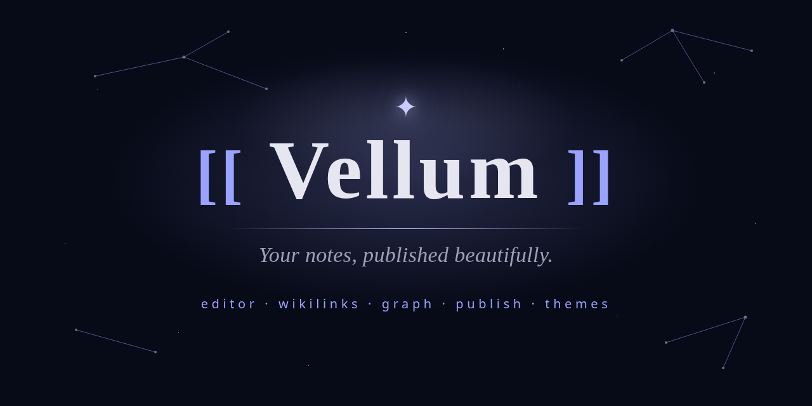
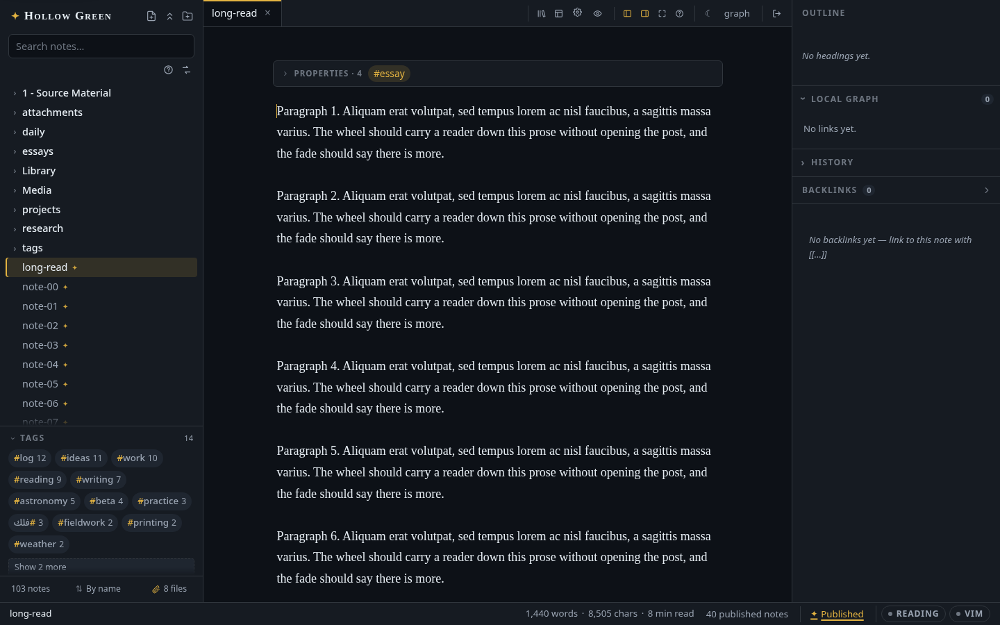
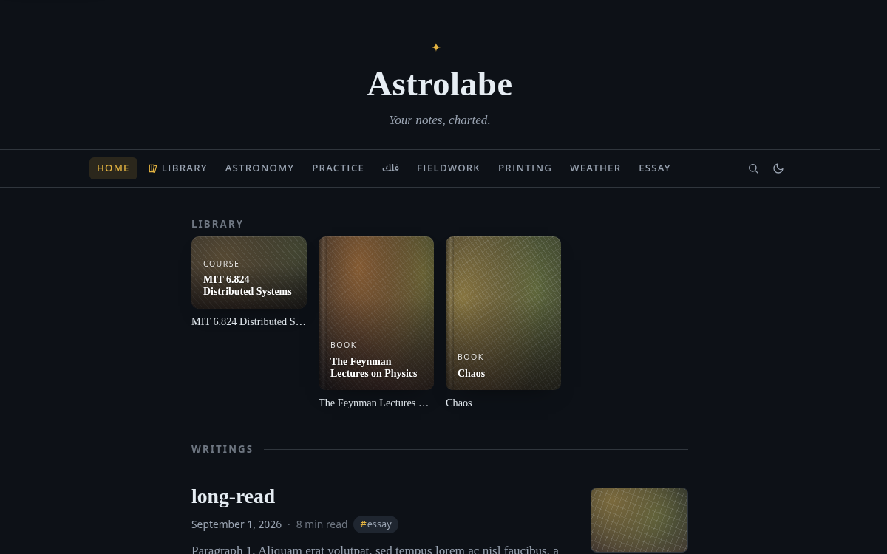
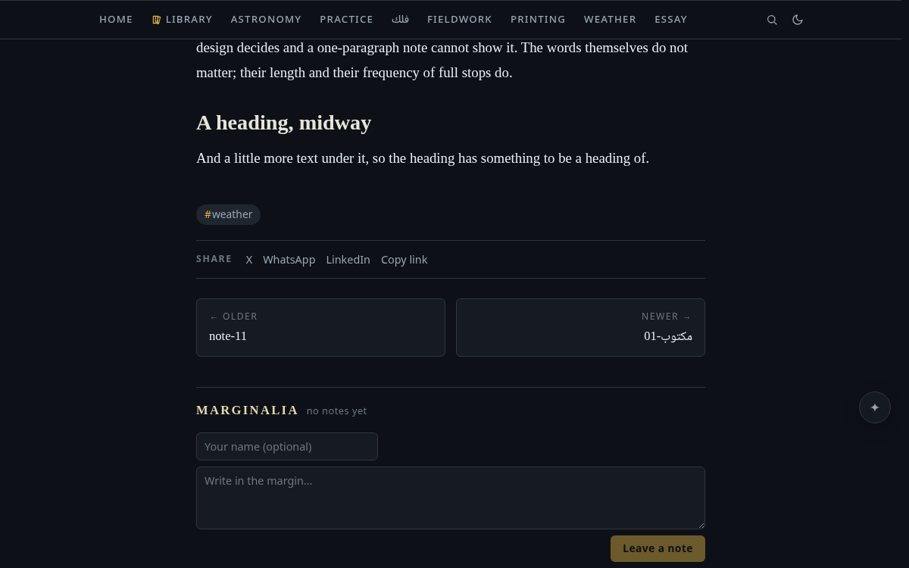
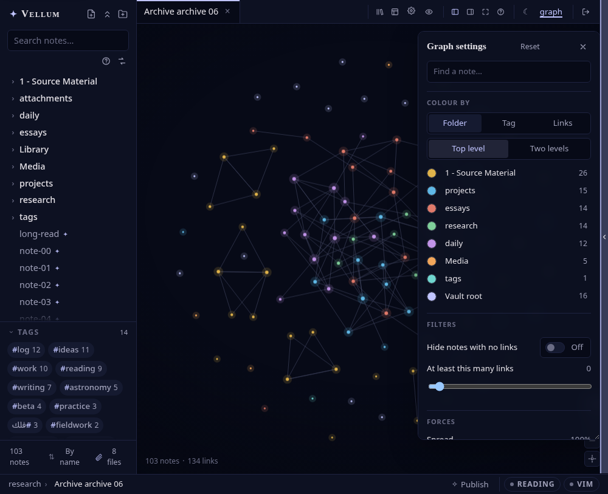

<p align="center"></p>

# Astrolabe

**Your notes, charted. A self-hosted reading room for a folder of plain Markdown and LaTeX, in Arabic and English as equals, with a press attached. One small Node process.**

<p align="center"><a href="https://zahakj.github.io/astrolabe/"><strong>✦ Visit the project site ✦</strong></a></p>

[](LICENSE)
[](package.json)

> An *astrolabe* was the instrument that told a traveller where they stood by the stars. This one runs on `localhost`.
>


**The manual** lives at [zahakj.github.io/astrolabe/site/en](https://zahakj.github.io/astrolabe/site/en/), with a full Arabic edition at [/site/ar](https://zahakj.github.io/astrolabe/site/ar/). The same pages are the markdown under [`docs/`](docs/README.md).

## What it is

Astrolabe is an instrument for people who read seriously and write from what they read. It runs as **one small Node process you host yourself**, over an ordinary folder of Markdown and LaTeX files, and everything it knows about your notes it reads from those files. It gives you a live-preview editor with wikilinks and backlinks; a graph; a search that understands Arabic letter forms and diacritics; a [PDF reader](docs/books.md) driven by vim keys that cites your highlights straight into the note beside it; [trackers](docs/trackers.md) for the books, games and courses you are working through; a [canvas](docs/drawing.md) for drawings; and a [typography](docs/typography.md) catalogue that sets Arabic and Latin on one line without flinching.

It is **bilingual by design**: Arabic and English are two equal renderings of the same product, with a mirrored shell, [Hijri dates](docs/arabic-and-rtl.md#hijri-dates), and right-to-left prose that behaves in the editor, the reading view and on the page. It opens **from any browser** on your network, so a phone, a laptop and the [desktop app](docs/desktop.md) are three windows on one vault.

When some of those notes deserve readers, the same vault becomes a public site with one frontmatter flag: articles, topics, RSS and reader comments in [blog mode](docs/blog-mode.md), a homepage you [compose](docs/designer.md) from sections or one of the shipped houses, and a [library](docs/library.md) that walks a reader through a course in order. Nothing is converted, wrapped or put in a database; delete the app tomorrow and the folder does not notice.

| | |
| --- | --- |
| <br>*Blog mode's dashboard home — posts as cards, each with a generated gradient until you set a banner.* | <br>*An article page: related posts, then "Marginalia" — built-in, rate-limited reader comments.* |
| <br>*Graph view — a hand-rolled canvas force simulation; drag nodes, click to open.* | <br>*Twenty-two hand-tuned themes — fifteen dark, seven light — each defining its whole palette.* |

## Quickstart

Needs **Node ≥ 24** (`node --version`).

```sh
git clone https://github.com/ZahakJ/astrolabe.git
cd astrolabe
npm install
npm start
```

Open **http://localhost:6801**. On first launch Astrolabe creates `./vault` and seeds it with
interlinked starter notes that double as the user manual.

### Point it at your own notes

Any folder of `.md` (and `.tex`) files is a vault — including one you already keep in another tool:

```sh
ASTROLABE_VAULT=~/notes npm start
# or:  npm start -- --vault ~/notes
```

Astrolabe reads and writes the conventions the Markdown world already shares: `[[wikilinks]]`
(aliases, `#heading` links, rename-safe), `![[embeds]]`, callouts, `$…$`/`$$…$$` math, `#tags`
and frontmatter `tags:`, properties, highlights, comments, footnotes, daily notes, `{{date}}`
templates and `.excalidraw` drawings. Nothing is converted or moved, another tool's own config
folders are ignored, and attachments are served in place, so a vault you keep in Obsidian opens
here unchanged and keeps working there. ([Details](OBSIDIAN-COMPAT.md).)

### Publish it

Three steps from a private vault to a public site.

**1. Set an admin password**, so strangers read and only you write:

```sh
cp .env.example .env
npm run hash-password        # prompts, prints an argon2id hash
```

Put the hash in `.env` (single-quoted — it contains `$`), plus a cookie-signing secret:

```sh
ADMIN_PASSWORD_HASH='$argon2id$v=19$m=65536,...'
SESSION_SECRET=some-long-random-string   # e.g. openssl rand -hex 32
```

Visitors now get a read-only view; a "Sign in" link in the status bar unlocks editing for you.

**2. Mark a note as public** — add `publish: true` to its frontmatter, or press `Ctrl/Cmd Shift P`
with it open. Nothing else is visible to anyone.

**3. Turn on the blog**, in `.env` or live from Settings → Publishing & comments:

```sh
PUBLIC_LAYOUT=blog
SITE_NAME=Night Garden
```

Restart, and `/` is a blog: masthead, topic nav, article pages, RSS at `/feed.xml`, a sitemap at
`/sitemap.xml` and a `/robots.txt` that points at it. Put it on the
internet behind any HTTPS reverse proxy pointed at `localhost:6801` — see
[Publishing & access](docs/publishing.md).

## What's in it

- **[A live-preview editor](docs/editor.md)** — CodeMirror 6, wikilinks with autocomplete, hover previews, callouts, KaTeX, transclusions, slash commands, vim mode
- **[Backlinks, outline, graph and instant search](docs/editor.md#navigating)** — a hand-rolled canvas force simulation, MiniSearch over the whole vault, live file watching. Search takes **operators** (`tag:`, `path:`, `is:published`, `before:`/`after:`, `linkto:`/`linkfrom:`, negated with `-`) and **folds diacritics**, so «المقدمة» finds «الْمُقَدِّمَة» and `resume` finds *résumé*
- **[Search and replace across the vault](docs/editor.md#navigating)** — the thing every note-taker wants and nobody ships, because a bad vault-wide edit is unrecoverable. So it is built on the safety net rather than beside it: a dry run of every file and every line with a checkbox on each, an offer to snapshot the vault to git first, and one **Undo** on the toast. Matching is exact and frontmatter is never touched
- **[Templates and banners](docs/templates-and-notes.md)** — `{{date}}`, `{{time}}`, `{{title}}` templates in the syntax other tools share, a `banner:` hero on any note, drag-to-move sections, a trash you can restore from
- **[A PDF reader](docs/books.md)** — every PDF in the vault opens as a book: vim keys and a `:` command line, a page remembered by the file's bytes so a rename loses nothing, night mode that leaves the pictures alone, and highlights that cite themselves into the note beside you with Undo
- **[Panes, tabs and windows](docs/workspace.md)** — split the column, drag a tab to split, preview and pinned tabs, and several windows over one vault where one holds the edit lease and the other reads live
- **[LaTeX notes](docs/latex.md)** — `.tex` files are notes: edited, searched, linked and published like any other, and they still compile
- **[Drawings](docs/drawing.md)** — an Excalidraw canvas in a pane, saved into the vault as `.excalidraw` (or the `.excalidraw.md` form other tools' plugins read) so every tool opens the same file; a picture exported beside it on every save, so `![[sketch.excalidraw]]` renders in the editor, the reading view and on the published site without anyone loading the editor
- **[Trackers](docs/trackers.md)** — a `tracker` fence turns a note into a progress card for a book, a game, a course, with a bar you can nudge; a `tracker-board` fence shelves all of them, the Media page shelves them by kind with a form that writes the note for you, and the shelf knows who is looking
- **[Publishing](docs/publishing.md)** — one frontmatter flag, a real server-side visitor preview, rate-limited reader comments with built-in moderation
- **[Blog mode](docs/blog-mode.md)** — masthead, topic nav, dashboard home, hover previews, RSS, sitemap/robots and server-injected SEO meta
- **[Designed mode](docs/designer.md)** — compose your own homepage from sections, fifty-nine shipped presets, with the stock blog kept as an always-working fallback
- **[The library](docs/library.md)** — books, courses and lecture series as paths a reader walks in order: a folder becomes a shelf entry, its subfolders the chapters, its published notes the lessons
- **[Twenty-two themes](docs/theming.md)** — fifteen dark, seven light, every one gated at WCAG AA, plus a custom-theme builder and `custom.css`
- **[Real typography](docs/typography.md)** — a self-hosted font catalog and your own uploads, with per-character Arabic that sets correctly inside an English sentence
- **[Arabic & RTL](docs/arabic-and-rtl.md)** — the whole interface mirrored and translated, an optional visitor `EN`/`ع` switch, a language filter, Hijri dates
- **[A desktop app](docs/desktop.md)** — AppImage, deb, pacman and a Windows build: a native menu bar in both languages, recent vaults, an always-on-top reference window, find in page, and background updates
- **[Backup & sync](docs/backup-and-sync.md)** — commit the vault to a private git remote you own, manually or on a timer, fast-forward only
- **[Note history](docs/backup-and-sync.md#note-history-reading-what-the-backup-kept)** — every commit that touched the open note, read any revision as it was, restore one with an Undo behind it, and take a local snapshot before anything you are unsure about
- **A tour, for all of the above** — fifteen illustrated cards, each with a **Show me** that really opens the thing it describes. It is never shown at you: `Ctrl/Cmd P` → *Take the tour*, a quiet line on the empty vault, or the foot of the `Ctrl/Cmd /` sheet
- **Zero CDN requests.** No webfonts, no analytics, no telemetry, nothing phoning anywhere

## Documentation

| | |
| --- | --- |
| [Configuration](docs/configuration.md) | Every `.env` key, the Settings panel, every settings key |
| [Publishing & access](docs/publishing.md) | Passwords, sessions, the `publish:` flag, comments, HTTPS |
| [Blog mode](docs/blog-mode.md) · [Designed mode](docs/designer.md) | The two public shells |
| [The editor & reading view](docs/editor.md) | Live preview, rendering, navigation |
| [Templates, banners & notes](docs/templates-and-notes.md) · [LaTeX notes](docs/latex.md) | Authoring |
| [Theming](docs/theming.md) · [Typography](docs/typography.md) | The look |
| [Arabic & RTL](docs/arabic-and-rtl.md) | Language, direction, the filter, Hijri dates, tag labels |
| [Backup & sync](docs/backup-and-sync.md) · [Keymap](docs/keymap.md) · [Development](docs/development.md) | Operating and hacking on it |

Also in the repo: [`DESIGN.md`](DESIGN.md) (the rules a change is judged against),
[`CONTRACTS.md`](CONTRACTS.md) (the invariants the code has committed to), and
[`.env.example`](.env.example).

## Requirements

**Node ≥ 24**, and nothing else — no database, no build toolchain for the server. Three things set
that floor: type stripping on by default (22.18), `--env-file-if-exists` (22.9), and an unflagged
`node:sqlite` for the comments database (22.13). They line up at 24, the first LTS line carrying
all three. `engine-strict=true` is in `.npmrc`, so a clone on an older Node **fails at
`npm install`** with the required and actual versions in the message, rather than dying later with
a syntax error from inside a `.ts` file.

## Architecture

One process, one port, one origin. The **server** (`server/`) is Hono running on Node's native
TypeScript support — no build step — watching the vault with chokidar, keeping an in-memory
MiniSearch index plus a wikilink graph, streaming change events over SSE, and serving attachments
with ETags. Nothing is ever written outside the vault. The **client** (`client/`) is React +
zustand with a CodeMirror 6 live-preview plugin, a standalone reading-view renderer that shares the
editor's link/embed resolve logic, and a canvas graph view; Vite builds it into `dist/`, which the
same server serves statically. `shared/` holds the wire contract both sides import. Your notes stay
ordinary files on disk the entire time.

## License

[MIT](LICENSE) © 2026 avicenna
