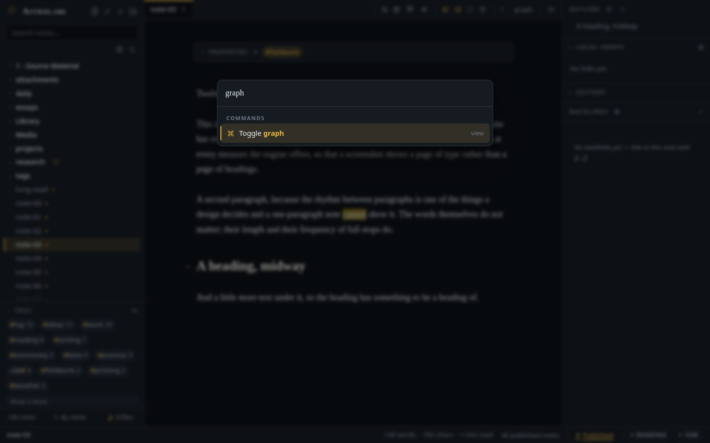

# المحرر وعرض القراءة

*ما الذي يفعله محرر المعاينة الحية، وأي ماركداون يعرضه أسطرلاب، وكيف تتنقل في خزانتك.*

← [العودة إلى README](../../README.md) · [كل الوثائق](../README.md)

---


كلمة أولى في المصطلحات. **الخزانة** هي المجلد الذي يفتحه أسطرلاب، وكل ملاحظة فيه ملف نصي عادي. **ماركداون** هو الترميز الخفيف الذي تُكتب به تلك الملفات: `**غامق**` و`# عنوان` و`- بند في قائمة`. **المقدمة** (frontmatter) هي الكتلة الصغيرة من سطور `key: value` بين سياجين من `---` في أول الملاحظة، وفيها تحفظ الملاحظة حقائق عن نفسها: وسومها، وتاريخها، وهل هي منشورة. و**رابط الويكي** هو `[[اسم ملاحظة]]`: رابط إلى ملاحظة أخرى، بالاسم. وستتكرر هذه الكلمات الأربع في بقية الصفحة من غير شرح.

## الكتابة

- **محرر معاينة حية** (CodeMirror 6). تختفي علامات ماركداون من كل سطر إلا السطر الذي تكتب فيه. تظهر العناوين بخط مُذيَّل، وتستطيع أن تعلّم مربعات المهام بالنقر، وتبدو `[[روابط الويكي]]` ذهبية، والوسوم حبوبًا صغيرة.
- **روابط ويكي مع إكمال تلقائي.** اكتب `[[` واختر أي ملاحظة من القائمة. يعرض `[[الاسم|كنية]]` كلمات أخرى مكان اسم الملاحظة، ويشير `[[الاسم#عنوان]]` إلى عنوان واحد داخلها (اكتب `#` داخل القوسين لتختار العنوان). يُعرض رابط العنوان بصيغة `ملاحظة › عنوان` ويقفز إلى ذلك العنوان مباشرة. وإذا أعدت تسمية ملاحظة، أُعيدت كتابة كل رابط كان يشير إلى اسمها القديم.
- **انقر لتتبع الرابط، وانقر لتنشئ الملاحظة.** النقرة العادية على رابط معروض تفتح الملاحظة. أما إذا كان الرابط متقطّع الخط فالملاحظة غير موجودة بعد، والنقر عليه ينشئها.
- **تحديد يفهم ما تحته.** النقر المزدوج يأخذ الكلمة التي تحت المؤشر، ويعامل الحرف وما عليه من حركات وحدةً واحدة، فتبقى الحركات العربية والفاصل غير المرئي الذي تستعمله الفارسية (ZWNJ) داخل الكلمة ولا يقطعانها. وإذا نقرت نقرًا مزدوجًا على شيء معروض أخذته كله: رابط ويكي، أو `#وسم`، أو مقطع `$رياضيات$`، أو شريحة كود. وداخل سياج الكود يأخذ النقر المزدوج الاسم كاملًا، حتى `$jquery` و`snake_case_name`. والنقر الثلاثي يأخذ الفقرة، والسحب يمدّ التحديد حرفًا حرفًا، والنقر مع Shift يمدّه من حيث كنت. ويختبر `npm run check-caret` هذا كله في الواجهة الإنجليزية والعربية.
- **بطاقة الخصائص تُحرَّر في مكانها.** ما دام مؤشرك خارج المقدمة تنطوي إلى بطاقة أنيقة من مفاتيح وقيم، فيها وسوم تُنقر، وتحرّرها هناك مباشرة: انقر قيمة لتكتب فوقها، وعلّم مربعًا لتبدّل بين `true` و`false`، واختر تاريخًا من تقويم، وأضف إلى القوائم قيمًا أو احذف منها شريحةً شريحةً، وأضف خاصية، أو أزل خاصية بالعلامة × في آخر صفها. ويعرض **إضافة خاصية** كل مفتاح يفهمه التطبيق (`title` و`tags` و`aliases` و`banner` و`date` و`publish` و`description` و`dir` و`align` و`numbered` و`icon` و`language` و`cssclasses`) مع سطر يشرح ما يفعله كل منها. اكتب لترشّح القائمة، وتنقّل بـ↑/↓ ثم اضغط Enter لتأخذ واحدًا، أو اكتب أي مفتاح من عندك. ويُكتب `tags` و`aliases` على هيئة قوائم؛ فالقيم المفصولة بفواصل تصير عناصر. والملاحظة التي لا خصائص لها بعدُ تظهر لها البطاقة أيضًا: سطر واحد فيه *إضافة خاصية* و*تعيين الغلاف…*، فتبدأ كل ملاحظة من المكان نفسه (ويوقف ذلك الخيار *بطاقة الخصائص في الملاحظات الفارغة* في الإعدادات ← اللغة والتواريخ).
  وكل تعديل من هذه **لا يمسّ إلا موضعه**: يبقى أسلوب علامات الاقتباس عندك، وتعليقاتك، وترتيب مفاتيحك، وكل سطر لم تمسّه، كما كان بالضبط. وحذف آخر خاصية يحذف معها سياجَي `---` بدل أن يترك خطًّا فاصلًا فارغًا. أما المفاتيح التي تكتبها البرامج لا الناس (`id` و`uuid` و`dg-*`) فتبقى للقراءة فقط، ولـ`publish:` مفتاحه الخاص في شريط الحالة. ويعمل الأمر نفسه في ملاحظة `.tex`، حيث تسكن الخصائص في كتلة تعليق تبدأ بـ`%---`.
- **القوالب.** `{{date}}` و`{{time}}` و`{{title}}` و`{{date:FORMAT}}` بالصياغة التي تتشاركها الأدوات الأخرى، ومعها `{{hdate}}` للتاريخ الهجري، و`{{cursor}}` لموضع المؤشر بعد الإدراج، و`{{prompt:Label}}` لسؤال يطرحه القالب قبل أن يُدرج. أدرج قالبًا عند المؤشر، أو ابدأ ملاحظة جديدة من قالب؛ ويعرض لك المنتقي النتيجة بعد تعبئتها قبل أن تعتمدها. انظر [القوالب](templates-and-notes.md#القوالب).
- **الصق المرفقات أو أسقطها.** الصورة التي في حافظتك، أو أي ملف مقبول تسحبه من مدير الملفات (PDF وصوت وفيديو أيضًا)، تُرفع وتحطّ بصيغة `![[name.png]]` عند المؤشر، ويحجز مكانها عنصر نائب مكتوب عليه «جارٍ الرفع…» حتى يصل الملف. أما المجلد الذي يحطّ فيه ما تلصقه أو تسقطه في الملاحظة فـ[إعداد](configuration.md#المرفقات) تختاره أنت. وتستطيع أيضًا أن تسقط الملفات مباشرة على شجرة الشريط الجانبي: على صف مجلد، أو صف ملاحظة، أو خلفية الشجرة نفسها. والإسقاط على الشجرة إيداع في مجلد بعينه: يحطّ الملف في المجلد الذي قصدته، مهما قال الإعداد. والنوع الذي سيرفضه الخادم يُرفض قبل أن يبدأ الرفع لا بعده، والرسالة التي تخبرك بنتيجة الإسقاط تحمل زر تراجع.
- **أوامر الشرطة المائلة.** اكتب `/` في أول السطر تظهر لك قائمة بما يمكن إدراجه، تترشّح وأنت تكتب: تنبيه، أو سياج كود (مع بحث عن اللغة)، أو هيكل جدول، أو قائمة مهام، أو كتلة رياضيات، أو فاصل، أو تاريخ اليوم، أو رابط إلى ملاحظة اليوم.
- **تواريخ بالكلام.** اكتب `@` في أول كلمة تظهر قائمة صغيرة فيها *اليوم* و*غدًا* و*أمس* و*الأسبوع القادم* وأيام الأسبوع السبعة القادمة؛ وواصل الكتابة فتقرأ ما كتبته: `@بعد ٣ أيام`، و`@الخميس القادم`، و`@١٥ سبتمبر`، و`@قبل أسبوعين` — أو بالإنجليزية `@in 3 days` و`@next thursday` و`@15 september`. يعرض كل صف اليوم الذي يقصده بتقويم الموقع، ويضع Enter مكان `@` رابطًا إلى **ملاحظة ذلك اليوم اليومية** بصياغة يقولها القارئ: `[[daily/2026-09-16|الأربعاء]]` ليوم في هذا الأسبوع، و`[[daily/2027-12-15|١٥ ديسمبر ٢٠٢٧]]` لما هو أبعد. ويتبع المجلد والاسم [إعدادات ملاحظتك اليومية](templates-and-notes.md#الملاحظات-الدورية). واسم الشهر هو الذي يقرّر التقويم: `@١٥ رمضان` و`@15 ramadan` يومان هجريان مهما كان إعداد الموقع. أما الأرقام المجردة (`15/9`) فتُرفض عمدًا، لأنها تُقرأ في كل بلد بترتيب مختلف. ولا تفتح القائمة إلا في أول كلمة ولا تفتح داخل الكود أبدًا، فيُترك `me@example.com` و`@` في سياج كود وشأنهما.
- **إكمال التنبيهات والسياجات.** اكتب `> [!` فيُقترح عليك كل نوع تنبيه بأيقونته ولونه؛ واكتب ` ``` ` فتُقترح اللغات وأنت تكتب.
- **معاينة حين يقف المؤشر.** ضع المؤشر على `[[رابط ويكي]]` فتظهر بطاقة عائمة فيها مطلع الملاحظة المقصودة معروضًا (و`[[ملاحظة#عنوان]]` يعاين من ذلك العنوان). ومراجع الحواشي تعاين تعريفها. وضع المؤشر على **وسم في الشريط الجانبي** تعرض البطاقة أحدث ثلاث ملاحظات تحمله — العنوان والمجلد وسطر من كل واحدة — وتحتها عدد الملاحظات كلها، فيصير العدد لمحةً قبل أن يصير نقرة.
- **جراحة الأقسام.** اطوِ عنوانًا، أو استخرجه إلى ملاحظة جديدة، أو اسحبه في المحتويات لتنقل الفرع كله. انظر [الأقسام](templates-and-notes.md#الأقسام-طيّ-واستخراج-ونقل).
- **ترقيم تلقائي للعناوين.** معطّل افتراضيًا. يشغّله زر `1.` في لوحة المحتويات لعرض القراءة، و`numbered: true` في مقدمة الملاحظة يرقّمها للجميع، حتى على المدونة. ولا يُكتب شيء في ماركداونك.
- **استمرار القوائم والاقتباسات.** يواصل `Enter` قوائم `-` ومهام `- [ ]` والقوائم المرقّمة واقتباسات `>`؛ و`Enter` على بند فارغ ينهي القائمة. و`Ctrl/Cmd ↑/↓` ينقل السطر الحالي إلى الأعلى أو الأسفل. والصق رابطًا فوق نص محدد تحصل على رابط ماركداون.
- **تنسيق النص بالمفاتيح التي تعرفها.** `Ctrl/Cmd B` و`I` و`U`، ومعها الشطب (`Ctrl/Cmd Shift X`) والتظليل (`Ctrl/Cmd Shift H`)، وهي اختصارات أوبسيديان نفسها. كل واحد منها يبدّل الحالة، ويعمل بلا تحديد (تُدرج العلامتان ويقف المؤشر بينهما)، ويُطبَّق سطرًا سطرًا على تحديد يمتد عدة أسطر. انظر [الاختصارات](keymap.md#لماذا-هذه-المفاتيح).
- **قائمة التحديد وشريط الأدوات العائم.** انقر بالزر الأيمن على تحديد (أو اضغط `Shift F10`) تظهر القائمة كاملة، مجمّعة: أسلوب النص، والبنية، والإدراج، واللون. تعمل من لوحة المفاتيح كلها، ولا تخرج عن حدود الشاشة، وتنعكس في العربية. ويعوم فوق كل تحديد شريط صغير على طريقة Notion فيه الإجراءات الستة الأكثر استعمالًا؛ يوقفه آخر صف في القائمة، وتعيده لوحة الأوامر.
- **القراءة بصوت عالٍ.** آخر صف في قائمة التحديد، أو `Ctrl/Cmd Shift .` في أي مكان، يقرأ الكلمات المحدّدة بصوت عالٍ باللغة التي كُتبت بها — الفرنسية واليابانية والعربية والإنجليزية — بأصوات تعمل على معالج جهازك نفسه؛ وفي عرض القراءة يفعل الأمرَ نفسه زرٌّ صغير تحت التحديد. انظر [القراءة بصوت عالٍ](read-aloud.md).
- **فوريغانا فوق الكانجي.** `{漢字|かんじ}` تُعرض روبي في كل سطح؛ حدّد كلمة فيها كانجي، ثم النقر الأيمن ← إدراج ← **فوريغانا…** لقراءات مقترحة، أو شغّل الأمر التلقائي. انظر [اليابانية والفوريغانا](japanese.md).
- **عناوين بلون تختاره.** كل عنوان، في المحرر وفي عرض القراءة سواء، يأخذ لونه من رمز `--heading` في السمة. ويضبطه منشئ السمات المخصصة مباشرة (السمات ← سمة مخصصة جديدة ← النص)، وتتبعه عناوين مقالات المدونة وعناوين صفحات المكتبة. انظر [السمات](theming.md#اصنع-سمتك).
- **نص ملوّن على مستويين.** لوحة ألوان تراعي السمة وتبقى مقروءة (تباين AA) على كل سمة مدمجة، ولوحة ثابتة الحبر حين تقصد *ذلك* اللون بعينه. انظر [السمات](theming.md#نص-ملوّن-على-مستويين).
- **حذف يقول لك ما الذي سيأخذه**، و**متصفح للمهملات**. انظر [الحذف](templates-and-notes.md#الحذف-والمهملات).
- **وضع Vim** لمن اعتاد مفاتيح ذلك المحرر، وحفظ تلقائي (بعد 600 مللي ثانية من توقفك عن الكتابة، ومعه `Ctrl/Cmd S`)، وواجهة صُممت لتُقاد من لوحة المفاتيح.

## الجداول

الجدول في ملاحظتك خطوط عمودية وشرطات، وهذا كل ما هو عليه على القرص. أما في المحرر فيُرسم جدولًا،
كما يرسمه عرض القراءة تمامًا، **وأنت تحرّره هناك**، داخل الشبكة، دون أن تعود الخطوط العمودية إلى وجهك.

**انقر خلية واكتب.** يفتح داخل الخلية صندوق بخط الخلية نفسه، ويحتفظ العمود بعرضه فلا يتزحزح شيء
تحت مؤشرك. وما تراه في الصندوق هو *مصدر* الخلية — فـ`**غامق**` تبقى `**غامق**`، و`[[رابط ويكي]]`
يبقى رابط ويكي، جاهزًا للتحرير بصيغة ماركداون، ويعود المعروض ما إن تغادر. وأي `|` تكتبه يُهرَّب لك
(`\|`) فلا يشقّ خطٌّ عموديٌّ داخل خلية صفَّها أبدًا.

**المفاتيح، وأنت داخل خلية.**

| المفتاح | ما يفعله |
| --- | --- |
| `Tab` / `Shift Tab` | الخلية التالية والسابقة، ومحتواها محدَّد فتحلّ الكتابة محلّه. و`Tab` في الخلية الأخيرة يضيف صفًا. |
| `Enter` | صفٌّ إلى أسفل في العمود نفسه. ومن الصف الأخير يخرج من الجدول. |
| `Shift Enter` | فاصل سطر داخل الخلية (`<br>` — وهو الوحيد الذي يحتمله جدول ماركداون). |
| `←` `→` | التنقل داخل الصندوق، وعند طرفه الانتقال إلى الخلية المجاورة. وفي جدول يُقرأ من اليمين ينعكسان، لأنهما يتبعان ما تراه. |
| `↑` `↓` | الخلية فوق أو تحت. |
| `Esc` | عودة إلى الملاحظة، والمؤشر بعد الجدول مباشرة. والخلية التي كنت فيها تعود إلى ما كانت تقوله. |
| `Shift F10` | قائمة الجدول (أدناه) على الخلية التي أنت فيها. |

ولا يُكتب شيء وأنت تكتب. تُكتب الخلية حين تغادرها — بـ`Tab` أو `Enter` أو نقرة في مكان آخر —
**تغييرًا واحدًا وخطوة تراجع واحدة**، تمسّ حروف تلك الخلية ولا تمسّ سواها. وكل خلية أخرى في الملف
تخرج بايتًا بايت كما دخلت.

**قائمة الجدول.** انقر أي خلية بالزر الأيمن — أو اضغط `Shift F10`، أو على شاشة اللمس زرّ `⋯`
تحت الجدول. وهي تعمل على الخلية التي فتحتها منها:

- **إدراج صف فوق / تحت**، و**إدراج عمود قبل / بعد**.
- **حذف الصف**، و**حذف العمود**، و**تكرار الصف**، و**تفريغ الخلية**.
- **نقل الصف لأعلى / لأسفل**، و**نقل العمود يسارًا / يمينًا**. واليسار واليمين هما ما تراه: في
  جدول عربي ينعكسان، وصفّ المحاذاة ينتقل مع عموده فيبقى العمود الموسَّط موسَّطًا.
- **محاذاة العمود يسارًا / توسيطه / يمينًا**، وعلامة صحّ على القائم منها الآن. واختيار المحاذاة
  التي عليها العمود أصلًا يرفعها عنه.
- **ترتيب حسب هذا العمود** — أ→ي، أو ي→أ، أو الأصغر رقمًا أولًا. والعنوان لا يتحرك، والخلايا
  الفارغة في الآخر، و`١٢` اثنا عشر.
- **تحرير بصيغة ماركداون** — يتنحّى الجدول المرسوم للخطوط العمودية، والمؤشر في الخلية التي كنت
  عليها. وللعودة أخرج المؤشر من الكتلة فيُرسم الجدول من جديد.
- **نسخ الجدول بصيغة ماركداون** — الجدول كله، مرتَّبًا، في حافظتك.

وكلٌّ من هذه خطوة تراجع واحدة.

**والجداول الكبيرة تبقى صالحة للعمل.** الجدول العريض ينزلق عرضًا داخل كتلته بدل أن يمدّ الملاحظة،
والكلمة في عمود مضغوط لا تُكسر حرفًا حرفًا أبدًا. والجدول الأطول من النافذة ينزلق داخل نفسه
و**صفّ عنوانه مثبَّت في أعلاه**، فيبقى للعمود الذي تكتب فيه اسمٌ تراه. وجدول من مئتي صف يُحرَّر
بسرعة جدول من ثلاثة: كتابة الخلية تعيد رسم تلك الخلية، لا الجدول.

**وإنشاء واحد.** اكتب `/` واختر *جدول* فيُدرج هيكل 2×2 عند المؤشر، أو نفّذ **إدراج جدول…** من
`Ctrl/Cmd P` وامسح الشبكة الصغيرة بالحجم الذي تريد (3 × 3 بادئ الأمر، وصفّ العنوان محسوب منها).
وتحمل اللوحة كذلك **جدول: إدراج صف فوق / تحت**، و**إدراج عمود قبل / بعد**، و**جدول: تحرير بصيغة
ماركداون**، وكلها تعمل على الجدول الذي فيه مؤشرك.

**وحين تكون الخطوط العمودية ظاهرة** — لأنك طلبتها، أو لأنك أدخلت المؤشر في الكتلة — تبقى المفاتيح
القديمة عاملة: `Tab` و`Enter` يمشيان في الخلايا، و`Alt ↑ / ↓` ينقلان صفًا، و`Alt ← / →` ينقلان
عمودًا. وحين تغادر الكتلة تجد الخطوط قد اصطفّت لك. انظر [الاختصارات](keymap.md#الجداول).

## تصحيح الفرنسية وأنت تكتب

إن كنت تكتب بالفرنسية فالمحرر يعيد الحركات إلى مواضعها في هدوء. اكتب `tres` ثم مسافة تصبح `très`؛ و`coeur` تصبح `cœur`، و`etre` تصبح `être`، و`Ecole` تصبح `École`، و`deja` تصبح `déjà`، و`ca` تصبح `ça`. ولا يظهر على الشاشة ما يخبرك بذلك: الكلمة المصحَّحة هي الرسالة كلها. وهو مفعّل افتراضيًا، ويوقفه الإعدادات ← هذا الجهاز ← **تصحيح الفرنسية تلقائيًا**.

- **في السطور الفرنسية وحدها.** يُعدّ السطر فرنسيًا حين تكون فيه كلمتان فرنسيتان على الأقل (`je` و`est` و`les` و`pour` و`c'est`…)، أو حين تقول مقدمة الملاحظة `lang: fr` فيُعدّ كل سطر فيها فرنسيًا. ولذلك تبقى `This is tres chic` في جملة إنجليزية كما كتبتها بالضبط: السطر الإنجليزي الذي فيه كلمة فرنسية واحدة يبقى سطرًا إنجليزيًا، والمحرر لا يعدّل كلمة لم تطلب تعديلها. والكلمة المكتوبة بحروف كبيرة (`UN` و`LA` و`EST`) لا تُحسب؛ والسطر الذي فيه كلمة إسبانية أو إيطالية أو برتغالية أو كتالانية (`el` و`del` و`una` و`di` و`não`…) ليس فرنسيًا، لأن تلك اللغات تشارك الفرنسية `la` و`de` و`un` و`que`؛ وسطر عربي أو عبري أو صيني لا يكون فرنسيًا أبدًا مهما حمل من كلمات لاتينية.
- **عند نهاية الكلمة وحدها.** يقع التصحيح حين تُتمّ الكلمة: بمسافة أو فاصلة أو نقطة أو Enter أو قوس أو علامة اقتباس تُغلقها. وما دمت تكتب الكلمة فلا يتحرك شيء. ولأن أولى كلمات السطر تكتمل عادةً قبل أن تأتي كلمته الفرنسية الثانية، فحين *يصير* السطر فرنسيًا، بـ`je` أو `les` فيه، تُصحَّح الكلمات التي سبقت أيضًا في خطوة واحدة: تصبح `Tres bien, c'est` هي `Très bien, c'est` عند الفاصلة العليا.
- **الكلمات التي لا تحتمل إلا وجهًا واحدًا.** تضم القائمة بضع مئات من الرسوم التي ليست كلمات من غير حركاتها: `tres` و`etre` و`hopital` و`francais` و`ecole` و`deja` و`bientot` و`theatre` و`evenement` و`oeuvre`… ولا تمسّ أبدًا كلمة موجودة بالوجهين: `a`/`à` و`ou`/`où` و`la`/`là` و`sur`/`sûr` و`du`/`dû` و`cote`/`côte`/`côté` و`tache`/`tâche` و`mur`/`mûr` و`eleve`/`élève`/`élevé`، ولا كلمة تحتمل حركاتها موضعين، مثل `cree` (`crée` أو `créé`) و`resume` (`résume` أو `résumé`) و`reserve` (`réserve` أو `réservé`)؛ فتلك تحتاج قارئًا لا جدولًا. والحرف الكبير يتبعك (`Etat` ← `État`)، والكلمة المكتوبة كلها بحروف كبيرة تُترك كما هي.
- **والمسافات الفرنسية أيضًا.** المسافة التي تكتبها قبل `;` و`:` و`!` و`?` تصبح المسافة الضيقة غير الفاصلة التي تريدها الطباعة الفرنسية هناك، فلا تبدأ علامة الاستفهام سطرًا وحدها أبدًا؛ والمسافة الملاصقة لداخل `«` أو `»` تصبح مسافة غير فاصلة؛ والنقاط الثلاث تصبح حرف `…` الواحد. وتتبع هذه كلها قاعدة السطر الفرنسي نفسها.
- **لا في الشيفرة ولا في الروابط ولا في الرياضيات.** سياج الشيفرة، والشيفرة داخل السطر، وعنوان الرابط، وهدف رابط الويكي، والمقدمة، و`$math$`، و`\command`، وكل ما داخل عنوان URL ليست نثرًا ولا تُصحَّح أبدًا.
- **تراجع واحد يعيد تصحيحًا واحدًا.** كل تصحيح خطوة تراجع مستقلة: اضغط `Ctrl/Cmd Z` مباشرة بعد `très ` تعود إلى `tres ` — الكلمة كما كتبتها والمسافة في مكانها — ويتذكر المحرر أنك رفضته فلا يصحح تلك الكلمة في ذلك الموضع مرة أخرى. (والكلمات التي يأخذها السطر حين يصير فرنسيًا خطوة واحدة معًا.) ومع مفاتيح Vim يقع التصحيح في وضع الإدراج وحده.
- **وتُدقَّق إملائيًا بالفرنسية.** السطر الذي يعامله المحرر فرنسيًا يُسلَّم إلى القاموس الفرنسي أيضًا، فلا يخط القاموس الإنجليزي بالأحمر تحت الكلمات التي صُحّحت للتو. وفي تطبيق سطح المكتب يقع ذلك تلقائيًا. أما المتصفح فلا سبيل إلى سؤاله عن قواميسه، فيُترك السطر الفرنسي فيه من غير تدقيق حتى تقول أنت: **الإعدادات ← اللغة والتواريخ ← قواميس المتصفح**، وعلّم على الفرنسية (والعربية أو العبرية أو الفارسية إن كانت عند متصفحك؛ في كروم: الإعدادات ← اللغات ← التدقيق الإملائي)، ومن حينها يُسطَّر بالأحمر تحت أخطاء السطر الفرنسي لا تحت كلماته الصحيحة.

## التضمين

التضمين يضع ملفًا داخل ملاحظة: الصورة نفسها، أو بطاقةً لملف PDF أو zip، أو صفحةً واحدة من كتاب، أو مشغّلًا لتسجيل أو لفيديو، أو رسمة، أو ملاحظة أخرى. الصق ملفًا في المحرر أو أسقطه فيه فيُكتب التضمين عنك (ويُرفع الملف إلى [مجلد المرفقات](configuration.md#المرفقات)؛ يصل الفيديو إلى ٢٥٦ ميغابايت، وغيره إلى ١٠ — وخلف nginx ارفع `client_max_body_size` بما يوافق)؛ ولتكتبه بيدك اكتب `/embed` لترى الصيغ الثلاث، أو `![[` واختر الملف — تنفتح القائمة على ملفات خزانتك والصيغ فوقها. و**تضمين ملف…** في لوحة الأوامر يفعل الشيء نفسه من لوحة المفاتيح.

| ما تكتبه | ما يظهر |
| --- | --- |
| `![[name.png]]` | الصورة، بحجمها حتى عرض العمود. |
| `![[name.png\|300]]` | الصورة بعرض ٣٠٠ بكسل، في الوسط. |
| `` | الصورة بمسارها — ماركداون القياسية، نسبةً إلى الملاحظة. و`alt` هو ما يقوله قارئ الشاشة. |
| `![[file.pdf]]` | بطاقة للملف؛ انقرها لتفتح PDF في [القارئ](books.md). |
| `![[Book.pdf#page=42]]` | الصفحة ٤٢ من الكتاب مرسومةً صورةً، وتحتها «Book، ص ٤٢». و`\|300` يحدّد عرضها. |
| `![[lecture.mp3]]` | مشغّل صغير (وكذلك ogg وm4a وwav). |
| `![[clip.mp4]]` | مشغّل فيديو، لا يتجاوز عرض الملاحظة (وكذلك webm وmov وm4v وmkv وogv حيث يستطيع المتصفح تشغيلها؛ وما لا يستطيعه بطاقةٌ برابط تنزيل). وملف webm بلا صورة — تسجيل ملاحظة صوتية — هو المشغّل الصوتي الصغير. |
| `![[clip.mp4\|480]]` | الفيديو بعرض ٤٨٠ بكسل، في الوسط. |
| `![[clip.mp4#t=12]]` و`![[clip.mp4#t=12,30]]` | الفيديو يبدأ من 0:12 — ومع `,30` يتوقف عند 0:30. وتعمل `t=1:05` أيضًا. |
| `![[clip.mp4\|poster=frame.jpg]]` | الفيديو، وتظهر `frame.jpg` (أي صورة في الخزانة، باسمها) حتى يبدأ؛ ومن دونها الإطار الأول. وتُجمع مع العرض: `\|480\|poster=frame.jpg`. |
| `` | مشغّل الفيديو، بمساره. |
| `![[bundle.zip]]` | بطاقة للملف (zip وcsv وtxt وسائرها). |
| `https://youtu.be/…` في سطر مستقل | رابط — أو، إذا فعّلت **الإعدادات ← النشر والتعليقات ← تضمين الفيديو الخارجي**، مشغّل ذلك الموقع (YouTube وVimeo وPeerTube). |
| `![[sketch.excalidraw]]` | [الرسمة](drawing.md)، بالصورة التي تحفظها بجانبها. |
| `![[Note]]` و`![[Note#Heading]]` و`![[Note#^block]]` | الملاحظة، أو قسم منها، أو فقرة واحدة، بطاقةً. |

كل تضمين غير تضمين الملاحظة **يُلتقط**:

- **اسحبه.** داخل ملاحظته ينتقل سطر التضمين إلى حيث تُفلته — ومعه عرضه وصفحته و`{.center}` — وتراجع واحد يعيده. وإلى ملاحظة في لوحة أخرى تُكتب `![[…]]` نفسها هناك (مرجعًا ثانيًا إلى الملف الواحد، لا نسخةً منه). وإلى خارج التطبيق — سطح المكتب، أو مدير الملفات، أو رسالة بريد — يحمل السحب الملف نفسه في كروم وإيدج وتطبيق سطح المكتب، ورابطه في غيرها؛ وفي تطبيق سطح المكتب اضغط **Alt** وأنت تسحب لتسلّم البرنامج الآخر الملف الحقيقي من القرص. وفي عرض القراءة يحطّ الإفلات بين الكتل، ويدلّك خط على موضعه.
- **انقره بالزر الأيمن** (أو اضغط **Shift+F10** أو مفتاح القائمة والمؤشر على مصدره، أو انتقل بـTab إلى الصورة في عرض القراءة): **نسخ الصورة** يضع الصورة في الحافظة (والصفحة المرسومة تنسخ الصفحة)؛ و**نسخ الرابط** عنوان الملف؛ و**نسخ بصيغة ماركداون** التضمين كما كُتب تمامًا، بـ`|300` وغيرها؛ و**نسخ المسار** موضعه في الخزانة. و**فتح** يعرض الصورة في العارض، وPDF في القارئ، والرسمة في لوحتها. و**الانتقال إلى الصفحة** (للصفحة المرسومة وحدها) يفتح القارئ عندها. و**إظهار في الملفات** يجد صفّه في الشريط الجانبي؛ و**حفظ باسم…** ينزّله؛ و**إعادة تسمية…** تعيد تسمية الملف وتعيد كتابة كل ملاحظة تضمّنه؛ و**إزالة التضمين** تحذف السطر من هذه الملاحظة وتترك الملف مكانه. والصف الذي لا يعمل لا يظهر — لا حافظة، لا صفوف نسخ؛ والزائر لا يرى إلا نسخ الرابط وفتح وحفظ باسم….
- **وعلى الهاتف، أمسكه.** تظهر الصفوف نفسها لوحةً من الأسفل، و**نقل…** مكان السحب: إلى أعلى الملاحظة، أو تحت أي عنوان، أو إلى آخرها.

والفيديو يُلتقط من اسمه تحت المشغّل — فالضغط على الصورة هو شريط التقديم الخاص بالمشغّل — وقائمته فيها كل الصفوف إلا نسخ الصورة؛ و**فتح** يشغّله في العارض.

أدوات الصورة عليها حين **تقف بالمؤشر فوقها**: اسحب المقبض في زاويتها لتغيّر حجمها (تُكتب `|300` عنك؛ وانقر المقبض مرتين لتعود إلى حجمها الأصلي)، وثلاثة أزرار تحاذيها يسارًا أو وسطًا أو يمينًا بكتابة `{.left}` أو `{.center}` أو `{.right}` في آخر سطرها. والنقر على الصورة لا يبدّلها بمصدرها ولا يقفز بالعرض: تبقى الصورة، ويظهر المصدر بجانبها قابلًا للتحرير. والتضمين المكسور يأخذ عنصرًا نائبًا متقطّع الخط.

## العرض

- **محاذاة سطر.** اختم أي فقرة أو عنوان أو سطر صورة بـ`{.center}` أو `{.right}` أو `{.left}` أو `{.justify}` فتجلس تلك الكتلة حيث طلبت، متجاوزةً `align:` الخاص بالملاحظة. تختفي العلامة كما تختفي سائر علامات ماركداون. ويكتبها لك `/center` و`/right` و`/left` في قائمة الشرطة المائلة، وكذلك **النقر بالزر الأيمن ← المحاذاة** فوق تحديد، لكل فقرة يمسّها التحديد. ويقرأ Pandoc الأقواس نفسها، أما أوبسيديان فيعرضها نصًّا.
- **تضمين الملاحظات.** `![[ملاحظة]]` يعرض الملاحظة المقصودة بطاقةً كاملة (بتنبيهاتها ورياضياتها وتلوين كودها)، مع زر «افتح الملاحظة» حين يطول المقتطف عن البطاقة.
- **صفحة من كتاب.** `![[Book.pdf#page=42]]` يرسم تلك الصفحة في موضع التضمين — في المحرر (عنصر نائب بشكل الورقة حتى تُرسم)، وفي عرض القراءة، وعلى موقعك حين يكون الكتاب منشورًا. انقر التعليق لتفتح [القارئ](books.md) على تلك الصفحة؛ ونقرة الزائر تفتح الملف عندها.
- **الصوت.** `![[lecture.mp3]]` مشغّل حيثما تُقرأ الملاحظة. و`[[lecture.mp3#t=1:23]]` رابط إلى لحظة: النقر عليه ينقل المشغّل في الصفحة نفسها إلى 1:23 ويشغّله، أو يفتح الملف عند تلك اللحظة إن لم يكن في الصفحة مشغّل. تعمل `t=83` و`t=1:23` و`t=1:02:03` كلها؛ أعطه اسمًا بديلًا (`|الحجة`) وإلا أظهر الوقت.
- **الفيديو.** `![[clip.mp4]]` مشغّل في المحرر وعرض القراءة وعلى الهاتف وعلى موقعك حين تكون الملاحظة منشورة (وصورته الافتتاحية كذلك). لا يطلب شيئًا حتى يقترب من الشاشة، ثم لا يطلب إلا أول بايتات الملف؛ ويسلّم الخادم الباقي قطعًا كلما قدّمت، فيبدأ الفيلم الطويل فورًا. و`[[clip.mp4#t=1:23]]` ينقله كما ينقل الصوت. ويصل إليه Tab، ومفاتيح المتصفح نفسها تشغّله وتوقفه وتقدّمه.
- **فيديو من موقع آخر.** معطّل افتراضيًا. إذا فعّلت **الإعدادات ← النشر والتعليقات ← تضمين الفيديو الخارجي** صار عنوان YouTube أو Vimeo أو PeerTube في سطر مستقل — أو مكتوبًا `` — مشغّلَ ذلك الموقع في عرض القراءة وعلى موقعك، وبطاقةً بصورة الفيديو في المحرر (اضغط التشغيل ليُحمَّل المشغّل). والإطار هو الإطار المعزَّز للخصوصية (youtube-nocookie.com، ويُطلب من Vimeo ألّا يتتبّع) ولا يُحمَّل إلا حين يقترب من الشاشة — لكنه يظل صفحة موقع آخر داخل موقعك، ويعرف من يقرأ، ولهذا فالمفتاح بيدك. وعند تعطيله يبقى العنوان رابطًا.
- **المخططات.** سياج ` ```mermaid ` يُعرض مخططًا في المحرر وعرض القراءة وعلى موقعك — مخططات الانسياب والتسلسل وغانت وكل ما يرسمه Mermaid — بألوان السمة المعروضة، ويُعاد رسمه حين تتغير السمة. لا يصل العارض إلا لملاحظة تحمل سياجًا، ولا يجلب شيئًا من الشبكة. والمخطط الذي لا يُفهم يحتفظ بمصدره، معلَّمًا عند الحافة.
- **التنبيهات.** `> [!note]` و`[!tip]` و`[!warning]` و`[!danger]` وأخواتها: ملوّنة، بأيقونات، وتُطوى بـ`-`.
- **الرياضيات.** `$سطري$` و`$$كتلة$$`، يعرضهما KaTeX.
- **تلوين الكود.** الكتل المسيَّجة تُلوَّن لكل اللغات الشائعة، بألوان توافق السمة.
- **التظليل والتعليقات والحواشي.** `==تظليل==` و`%%تعليق مخفي%%` ومراجع `[^1]` المرتفعة التي تقفز إلى تعريفها — وتعود: في المحرر، النقر على `[^1]:` في الأسفل يضع المؤشر على موضع الإحالة؛ وفي عرض القراءة يفعل ↩ الشيء نفسه.
- **الحواشي الجانبية.** في عرض القراءة، حين يبلغ عمود القراءة 1180 بكسل أو أكثر وله هامش فائض، تُصفّ كل حاشية في الهامش الخارجي بجانب السطر الذي يحيل إليها — رقم صغير بخط السيرِف ثم نص الحاشية — وتُخفى القائمة في الأسفل. والحاشيتان اللتان تتصادمان تتراكبان نزولًا. وفيما دون ذلك العرض، وعلى الموقع، وفي بطاقة التضمين، وعلى الورق، تبقى الحواشي في الأسفل كما كانت. والملاحظة التي لا حواشي فيها لا يمسّها شيء.
- **عرض القراءة.** يقلب `Ctrl/Cmd E` الملاحظة إلى صفحة معروضة كاملة للقراءة فقط (بجداولها). ويحلّ الروابط كما يحلّها المحرر بالضبط.

ملفات `.tex` و`.latex` ملاحظات من الدرجة الأولى، ولها عارضها الخاص. انظر [ملاحظات LaTeX](latex.md).

## التنقل


- **لوحة الروابط الراجعة.** تعرض كل ملاحظة الملاحظاتِ التي تربط إليها، مع الجملة التي فيها الرابط.
- **لوحة الحواشي.** تحت المحتويات، حين تحمل الملاحظة المفتوحة حواشي: كل `[^n]` وما تقوله. انقر صفًّا لتصل إلى موضع الإحالة في النص (يذهب المؤشر إليه في المحرر؛ ويمرّر عرض القراءة إلى الرقم المرتفع)؛ والسهم الصغير في آخر الصف يصل بك إلى نص الحاشية بدل ذلك — في الأسفل، أو في الهامش حين تُعرض الملاحظة بحواشٍ جانبية. ويتذكر القسم إن طويتَه.
- **لوحة المحتويات (جدول المحتويات).** عناوين الملاحظة المفتوحة، تتابع موضع تمريرك؛ انقر عنوانًا لتقفز إليه.
- **عرض المخطط.** خريطة لملاحظاتك: نقطة لكل ملاحظة، وخط لكل رابط؛ تتنافر النقاط وتشدّها الروابط إلى بعضها حتى تستقر الخريطة، فتتجاور الملاحظات المترابطة من تلقاء نفسها. اسحب النقاط، وقف بالمؤشر على واحدة لتضيء جيرانها، وانقر لتفتح. يُفتح المخطط [تبويبًا](workspace.md#اللوحات) في اللوحة المركَّز عليها (`Ctrl/Cmd G`)، فيجلس المخطط والملاحظة جنبًا إلى جنب أو يتناوبان. ويفتح زر المنزلقات إعداداته: لوّن الملاحظات بحسب **المجلد** (بعمق مستوى أو مستويين) أو بحسب **الوسم** أو بحسب **الاستعلام**، مع مفتاح ألوان تستطيع فيه أن تعيد تلوين كل مجموعة أو تخفيها؛ وبحث يضيء الملاحظات المطابقة؛ ومرشحات تخفي الملاحظات اليتيمة (التي لا رابط لها) أو ما دون حدّ أدنى من الروابط؛ والقوى الثلاث (الانتشار، وطول الرابط، والجذب إلى المركز)؛ وحجم النقطة، وشفافية الروابط، ومستوى التكبير الذي تظهر عنده الأسماء، وهالة. ولوحة الإعدادات نفسها تضعها حيث تشاء: اسحبها من عنوانها إلى أي مكان فوق المخطط، واسحب زاويتها لتجعلها قصيرة أو ضيقة كما تحب، ويعيدها *إعادة الضبط* إلى مكانها. ويُحفظ هذا كله في المتصفح ولا يمسّ الخزانة.
- **مجموعات المخطط بالاستعلام.** يقبل *تجميع بالاستعلام* في مفتاح الألوان حتى ستة صفوف، في كلٍّ منها استعلام يقبله صندوق البحث (`tag:physics before:2026`، `path:Journal -is:published`، `linkto:Ledger`) بجانب لون. وتُصبغ كل ملاحظة يسمّيها الاستعلام بلونه؛ والملاحظة التي يسمّيها استعلامان تكون للصف الأول، فترتيب الصفوف أولويةٌ تراها. ويعدّد مفتاح الألوان كل استعلام مع عدد الملاحظات التي صبغها، ويجمع *بلا استعلام* الباقي باللون المحايد للسمة. والألوان الافتراضية ست درجات تُمشى من لون السمة الرئيس، فتنتمي المجموعات إلى السمة؛ وضع لونك أنت على الصف أو في مفتاح الألوان. ويُحفظ ذلك لكل متصفح مع بقية تفضيلات المخطط.
- **بحث في النص الكامل.** فوري، يجد الكلمة من أولها ويتسامح مع الخطأ الإملائي الصغير، ويعرض مقتطفات مظلَّلة نُزعت منها علامات ماركداون. ويجيب البحث على [تسميات الوسوم المحلية](arabic-and-rtl.md#تسميات-الوسوم-المحلية) كما يجيب على الأسماء الأصلية، و**يطوي الحركات وأشكال الحروف**، فتجد «المقدمة» ملاحظةً تكتبها «الْمُقَدِّمَة»، ويجد `resume` كلمة *résumé*. انظر [البحث بالعربية](arabic-and-rtl.md#البحث-بالعربية).
- **معاملات البحث.** تفتح علامة `?` تحت صندوق البحث بطاقة تعدّدها. تضيّق المعاملات النتائج معًا، ويمكن نفي أي واحد منها بـ`-` قبله:

  | النوع | يجد |
  | --- | --- |
  | `tag:recipes` | الموضوع وكل ما تفرّع تحته |
  | `path:Journal` | الملاحظات التي يحوي مسارها النص |
  | `is:published`، `is:page` | أعلام المقدمة |
  | `after:2024`، `before:2024-06-15` | بحسب تاريخ الملاحظة نفسها (`YYYY` و`YYYY-MM` و`YYYY-MM-DD` بالتوقيت العالمي؛ `after:` شامل من بداية المدة و`before:` يستثنيها، فـ`after:2024 before:2025` هي سنة 2024 بالضبط) |
  | `linkto:Ledger` | الملاحظات التي تربط **إلى** تلك الملاحظة |
  | `linkfrom:Ledger` | الملاحظات التي تربط **إليها** تلك الملاحظة |
  | `in:books`، `in:notes` | صفحات ملفات PDF على الرف وحدها، أو الملاحظات وحدها؛ انظر [البحث داخل كل كتاب](books.md#البحث-داخل-كل-كتاب) |
  | `-tag:draft` | كل شيء عدا |
  | `path:"Reading notes"` | قيمة فيها مسافة |

  والاستعلام المكوَّن من معاملات وحدها استعلام حقيقي: `tag:recipes` وحده يعدّد كل الوصفات، الأحدث أولًا. وكل ما لا يُفهم (`before:soon`، أو `tag:` من غير قيمة) يُعامل كلمةً عادية، بدل أن يطابق لا شيء في صمت.
- **بحث واستبدال في الخزانة كلها.** زر ⇄ تحت صندوق البحث (للمشرفين فقط). يحدد صندوق البحث **النطاق**: المعاملات التي فيه تقرر أي الملاحظات تدخل في الحساب، فـ`tag:recipes` يستبدل داخل الوصفات ولا شيء غيرها. وتحصل دائمًا على **معاينة أولًا**: كل ملف سيمسّه الاستبدال، وكل سطر، والبديل بجانب الأصل، ومربع اختيار على كل واحد. ثم زر واحد، ورسالة تحمل **تراجعًا**. وحين تكون الخزانة مستودع git تعرض اللوحة أن تأخذ **لقطة** أولًا، وهي معلَّمة افتراضيًا: التراجع الذي في الذاكرة ينتهي أجله، أما الإيداع فلا، فالاستبدال الذي تندم عليه غدًا يظل قابلًا للاسترجاع عبر [النسخ الاحتياطي والمزامنة](backup-and-sync.md). قاعدتان تستحقان أن تعرفهما قبل أن تكتب:

  - **المطابقة دقيقة.** تُحسب حالة الأحرف والحركات، ويُؤخذ النص بحروفه ما لم تعلّم *تعبير نمطي* (فيصير عندها نمطًا بصياغة JavaScript، بما فيه مراجع الالتقاط مثل `$1`، يُطبَّق سطرًا سطرًا، فتعني `^` و`$` طرفَي السطر). وصندوق البحث فوقه يطوي حالة الأحرف والحركات لأن البحث سؤال؛ أما الاستبدال فكتابة، واستبدال ينزع الحركات عن كلمة لم تكتبها أنت قط هو تدمير لنص لم تره.
  - **المقدمة لا تُمسّ أبدًا.** للخصائص محررها الخاص الذي لا يغيّر إلا موضع التعديل. أما تطبيق تعبير نمطي أعمى على المقدمة فهو ما تفسد به الأدوات الأخرى علامات الاقتباس عندك.

  والملف الذي تغيّر على القرص بين المعاينة والضغطة **يُتخطّى ويُذكر اسمه**، ولا يُكتب فوقه أبدًا.
- **الوسوم.** الوسوم `#السطرية` ووسوم `tags:` في المقدمة تُعدّ في الشريط الجانبي وتُنقر. تُرشّح النقرة الشجرة إلى ذلك الوسم؛ ويزيل `Esc` الترشيح من أي مكان في الشريط الجانبي (أو حين لا يكون التركيز على شيء)، وكذلك نقرة ثانية على الحبة المضاءة. انقر بالزر الأيمن على حبة وسم **لتعيد تسميته** في الخزانة كلها، الوسوم السطرية `#` ووسوم `tags:` في المقدمة سواء، ومعه كل ما تفرّع تحته (`#zettel` ← `#slip` يأخذ معه `#zettel/seed`). وإعادة التسمية إلى وسم موجود أصلًا **تدمج** الاثنين، ويقول لك الحوار ذلك قبل أن تضغط شيئًا. تُخبَر بعدد الملاحظات التي ستتغير قبل التنفيذ، وتحمل الرسالة التي تليه **تراجعًا** واحدًا. ولا تدخل إعادة الكتابة سياج كود ولا مقطع كود سطري، فـ`#define` في كتلة shell يُترك حيث هو؛ وتبقى علامات اقتباسك وتعليقاتك وكل مفتاح آخر في المقدمة كما هي بايتًا بايتًا. وتنتقل معه صفحة الوسم نفسها تحت مجلد الوسوم، و[تسميته المحلية](arabic-and-rtl.md#تسميات-الوسوم-المحلية) أيضًا.
- **أعد تسمية عنوان وتتبعه الروابط.** ينكسر رابط `[[ملاحظة#عنوان]]` في صمت حين يتغيّر اسم العنوان: يظل يفتح الملاحظة، لكنه يحطّ في أعلاها. فحين تحفظ ملاحظة غيّرت فيها عنوانًا تشير إليه ملاحظات أخرى يقول لك أسطرلاب: *«3 روابط تشير إلى «المقدمة». تحدّثها إلى «التمهيد»؟»*، وزر واحد يصلحها كلها. وهو عرض دائمًا، لا شيء يحدث تلقائيًا، ويحمل هو أيضًا تراجعًا.
- **المرفقات في الشجرة**، مع صندوق عرض ومشغلات وتنزيل. انظر [المرفقات](templates-and-notes.md#المرفقات).
- **أعد التنظيم بالسحب**، مع إصلاح كل رابط. انظر [إعادة التنظيم](templates-and-notes.md#إعادة-التنظيم-بالسحب).
- **ملاحظات يومية.** يفتح `Ctrl/Cmd Alt D` ملاحظة اليوم، وينشئها إن لم تكن موجودة (`daily/YYYY-MM-DD.md` ما لم [تضبطها على غير ذلك](templates-and-notes.md#الملاحظات-الدورية)).
- **واجهة تبتعد عن طريقك.** اطوِ أيًّا من اللوحتين الجانبيتين (`Ctrl/Cmd Alt B` و`Ctrl/Cmd Alt Shift B`) إلى مقبض نحيل يعيد فتحها، أو ادخل **وضع التركيز** (`Ctrl/Cmd Shift Z`): يتنحى الشريط الجانبي واللوحة الجانبية والتبويبات وشريط الحالة، ويجلس النص في وسط الشاشة على عرض مريح. يعيد `Esc` (أو علامة ✕ الباهتة) كل شيء. وتُحفظ كل حالة عبر إعادة التحميل، و**طيّ لوحة لا يحرّك الملاحظة أبدًا**: يبقى العمود في وسط النافذة بصريًّا أيًّا كانت اللوحات المفتوحة، مع فراغ مقصود بجانب مقبض اللوحة المغلقة.
- **الشريط الجانبي على أي الجانبين.** ثلاث حالات، في لوحة الأوامر وفي الإعدادات ← هذا الجهاز ← لوحة الملاحظات: *اتبع اللغة* (الافتراضي: يسارًا في الإنجليزية ويمينًا في العربية، ويُعاد النظر فيه كلما تغيرت اللغة)، أو ثبّته على الحافة اليسرى أو اليمنى نهائيًا.
- **لغة محررك لك وحدك.** ثلاث حالات أخرى في المكانين نفسيهما: *لغة المحرّر: تتبع الموقع* (الافتراضي) أو *English* أو *العربية*. وهو اختيار خاص بهذا المتصفح لا يغيّر شيئًا مما ينشره موقعك، فتستطيع أن تدير موقعًا عربيًا من محرر إنجليزي. ويسمّي كل صف في اللوحة لغته بحروف تلك اللغة، وهذا مقصود: يبقى الصف ظاهرًا حين تكون الواجهة بلغة لا تقرؤها. انظر [العربية والكتابة من اليمين](arabic-and-rtl.md#لغة-محررك-لك).
- **لوحة الأوامر.** يبحث `Ctrl/Cmd P` في الملاحظات والأوامر معًا. ولا يظهر الأمر إلا حين يطابقه الاستعلام حقًّا، بحدّ أقصى خمسة أوامر، تقف فوق ملاحظاتك أو تحتها بحسب أيهما طابق أفضل. (كانت كتابة `sort` تضع *صمّم موقعك* فوق الخزانة كلها.) وابدأ الاستعلام بـ`@` أو `#` لتقفز بدلًا من ذلك إلى عنوان (أو `\label` في LaTeX) داخل الملاحظة التي تقرؤها.
  وهي **مبدّل سريع** أيضًا. فحين لا توجد ملاحظة باسم ما كتبته تنتهي القائمة بصف **إنشاء «…»**: يضغط Enter فتُنشأ الملاحظة في مجلد الملاحظة التي أنت فيها (أو حيث يقول المسار الذي كتبته بالضبط) وتُفتح. وكل [تخطيط محفوظ](workspace.md) صف فيها — **تحميل التخطيط: بحث** — فيكفي `Ctrl/Cmd P` ثم اسم التخطيط ثم Enter لاسترجاع ترتيب كامل من غير منتقٍ. و**ملاحظة فريدة جديدة** تنشئ ملاحظة تُسمّى بالدقيقة (`202609151042`) ولا تسأل عن شيء؛ انظر [الملاحظات الفريدة](templates-and-notes.md#الملاحظات-الفريدة).
- **مراقبة حية للخزانة.** حرّر ملفًا في أي محرر آخر يتحدّث التطبيق خلال نحو عُشر ثانية.



## استعلامات حيّة

سياج ` ```query ` قائمةُ ملاحظات تجيب عن بحث، تُرسم حيّة حيثما تُقرأ الملاحظة: في المحرر، وعرض القراءة، والمدونة. يأخذ معاملات صندوق البحث وخمسة مفاتيح:

```query
tag:reading prop:status=reading -tag:draft
show: title, date, status, tags
sort: date desc
limit: 20
as: table
```

| المفتاح | القيم |
| --- | --- |
| `show` | الأعمدة: `title` و`date` و`modified` و`tags` و`excerpt` و`path`، أو أي مفتاح في المقدمة (`status`، `author`) |
| `sort` | `date` أو `modified` أو `title` أو `path` أو `relevance`، مع `asc` أو `desc` |
| `limit` | هذا العدد من الصفوف على الأكثر (500 حدًّا أقصى) |
| `as` | `list` (العنوان والمقتطف) أو `table` أو `cards` أو `timeline` |
| `by` | تاريخ الخط الزمني: `created` (تاريخ الملاحظة نفسها، وهو الافتراضي) أو `modified` أو أي مفتاح في المقدمة يحمل تاريخًا (`by: read`) |

**الخط الزمني** يصفّ الصفوف على خط رأسي تحت عناوين السنوات، الأحدث أولًا (`sort: date asc` للأقدم أولًا)، ولكل صف يومه؛ وتُطبع السنوات والأيام بتقويم الموقع، فالنسخة الهجرية تعنون سنواتها ١٤٤٧ و١٤٤٨. ومع `by: read` يُقرأ التاريخ من خاصية `read:` في كل ملاحظة — تُحسب `2026-03-04` و`2026/03/04` و`2026-03` و`2026` و`4 March 2026` كلها — والملاحظات التي تغيب خاصيتها أو لا تكون تاريخًا تجتمع في الآخر تحت *بلا تاريخ* بدل أن تختفي.

```query
tag:book
as: timeline
by: finished
show: title, author
```

وكل سطر آخر هو الاستعلام. و`prop:status=reading` معامل جاء مع هذه الميزة: ابحث بأي خاصية في المقدمة. و`prop:author` وحده يعني «لها هذه الخاصية»، و`-prop:draft` يستثني. والقائمة محدودة بما يحق للقارئ رؤيته (سياج الزائر في ملاحظة منشورة يعدّد الملاحظات المنشورة فقط)، وتُعاد قراءتها حين تتغير الخزانة. ويعرض أوبسيديان لغة السياج نفسها، فتبقى الملاحظة مقروءة هناك.

## المهام عبر الخزانة

كل سطر `- [ ]` مهمة. وتُقرأ من آخر السطر الحقول التي علّمت إضافة Tasks في أوبسيديان الخزائنَ كتابتها: `📅 2026-09-20` موعد الاستحقاق، و`⏳` الجدولة، و`🛫` البدء، و`✅` تاريخ الإنجاز، و`🔁 every week` التكرار، والأولوية `⏫ 🔼 🔽`. ويعدّد سياج ` ```tasks ` المهام من الخزانة كلها مجمّعةً بحسب الملاحظة، وفي المحرر كل مربع فيه حيّ: التعليم يقلب ذلك السطر الواحد في الملاحظة التي يسكنها ويختمه بـ`✅ اليوم`، فتقرأ إضافة Tasks في أوبسيديان الحالة نفسها.

```tasks
not done
due this week
tag:work
sort: priority
```

الأسطر: `not done` (الافتراضي) و`done` و`all`؛ و`due today` و`due this week` و`overdue` و`due before 2026-10-01` و`due after …` و`due on …` و`has due date`؛ و`path:Projects` و`tag:work` و`limit: 50` و`group: none` و`sort: due | priority | path`. وتفتح صفحة السِّجِلّ على المهام المستحقة حتى اليوم.

## إشارات غير مرتبطة

تحت الروابط الراجعة تعدّد اللوحة الجانبية الملاحظات التي يذكر نصُّها عنوان الملاحظة المفتوحة، أو أحد أسمائها البديلة، من غير أن تربط إليها. كلمات كاملة فقط، ولا تُحسب إذا كانت داخل رابط أو كود أو قالب، وتُطوى الحركات كما في البحث، فيجد العنوان العربي المشكول كتابته المجردة. يلفّ **اربط** تلك الكلمات في `[[Note]]` (أو `[[Note|الكلمات]]` حين لا تكون كتابة العنوان نفسها) بتعديل واحد في ذلك السطر؛ و**اربط الكل** يفعل ذلك في كل الصفوف. هكذا تُنسج الملاحظات الصغيرة شبكةً.

## بالجوار

تحت الروابط الراجعة يعدّد **بالجوار** الملاحظات العشر الأقرب قراءةً إلى الملاحظة المفتوحة، من غير نموذج ولا شبكة ولا شيء يغادر الخزانة. تتجاور ملاحظتان حين تستعملان الكلمات *غير الشائعة* نفسها: تُوزن كل كلمة بمقدار ندرتها في خزانتك (فالكلمة التي في كل ملاحظة لا تزن شيئًا، ولذلك لا حاجة إلى قائمة كلمات مهملة بأي لغة)، وتُحسب الوسوم كلماتٍ اختارها أحد فتزن أكثر، والدرجة هي تداخل المفردات الموزونة للملاحظتين (جيب تمام TF-IDF على المصطلحات المطوية نفسها التي يحملها فهرس البحث، فتكون الكلمة العربية المشكولة وكتابتها المجردة مصطلحًا واحدًا). ويعرض كل صف الدرجة نسبةً مئوية و**المصطلحين اللذين يربطان** الملاحظتين، فترى *لماذا* قبل أن تفتح؛ قف بالمؤشر على صف لتعاين، وانقر لتفتح. وتتابع القائمة الخزانة: أي تعديل في أي ملاحظة يحرّك كل الدرجات قليلًا، وتعيد اللوحة القراءة بعد كل تغيير. وهي لوحة المالك؛ فموقع الزائر لا يحصل عليها أبدًا، لأن الحساب يقرأ نص كل ملاحظة، ويُحفظ طيّها لكل متصفح.

وتحت «بالجوار» قائمتان أخريان تجيبان عن السؤال نفسه *بالمعنى* لا بالكلمات المشتركة: **ذات صلة**، أي الملاحظات التي تتناول الأشياء نفسها (بأي من اللغتين)، و**روابط مقترحة**، أي مقاطع في ملاحظات أخرى تستحق أن تربط إليها من الملاحظة التي تكتبها. وكلتاهما تحتاج Ollama على جهازك؛ انظر [اسأل الخزانة](ask.md#ذات-صلة).

## مراجع الفقرات

تستطيع أن تربط إلى فقرة بعينها أو بند قائمة بعينه، لا إلى الملاحظة كلها. اختمه بمسافة ثم معرّف يبدأ بالرمز `^`، مثل `…قاعدة الثلاثة. ^rule3`، أو ضع `^rule3` في سطر وحده تحت الفقرة مباشرة. عندها:

- يربط `[[Note#^rule3]]` إلى تلك الفقرة ويحطّ عليها؛ وتعرض بطاقة المعاينة تلك الفقرة وحدها؛
- يضمّن `![[Note#^rule3]]` تلك الفقرة وحدها، في المحرر وعرض القراءة والمدونة؛
- يقترح `[[Note#` في المحرر معرّفات الفقرات بجانب العناوين، وتعدّدها قفزة `#` في لوحة الأوامر.

تبقى العلامة مخفية في عرض القراءة وفي المعاينة الحية حتى يقف المؤشر على سطرها، فتظهر باهتة بخط ثابت العرض لتُقرأ أو تُغيَّر. ويصنع **نسخ رابط هذه الفقرة** في لوحة الأوامر معرّفًا للفقرة التي تحت المؤشر (أو يستعمل ما فيها إن كان لها معرّف)، ويلحقه بها في خطوة تراجع واحدة، وينسخ الرابط؛ وعلى سطر عنوان ينسخ رابط القسم بدلًا من ذلك. والصيغة صيغة أوبسيديان، فالخزانة التي تحمل `^ids` أصلًا تحتفظ بكل رابط.

## البحث والاستبدال

يفتح `Ctrl/Cmd F` البحث والاستبدال داخل الملاحظة. اكتب، ويقول لك العدّاد أين أنت. ينتقل `Enter` إلى المطابقة التالية، و`Shift+Enter` إلى السابقة؛ و`Enter` في حقل الاستبدال يستبدل واحدة، و`Ctrl/Cmd+Enter` يستبدل الكل. والحبوب الثلاث هي: مطابقة حالة الأحرف، والتعبير النمطي، والكلمة الكاملة. ويفتح `Ctrl/Cmd Shift F` **البحث والاستبدال في الخزانة كلها** في الشريط الجانبي: كل ملاحظة مطابقة، سطرًا سطرًا، معلَّمة أو غير معلَّمة، تُستبدل دفعة واحدة مع تراجع ولقطة اختيارية قبلها. و`Esc` من أي حقل في تلك اللوحة يغلقها.

## الشريط والعنقود العلوي

يقول الشريط الذي تحت الملاحظة أين أنت، وكم طول الملاحظة، وهل هي منشورة، وفي أي وضع أنت. وما دام هناك نص محدد يقرأ العدّ **١٢ من ٨٤٠ كلمة**، التحديد في مقابل الكل، فلا يضطرك تقصير فقرة إلى إلغاء التحديد لترى المجموع. والعدّ قاعدة واحدة للكاتب ولـ*«N دقائق قراءة»* في المدونة سواء: فالمقدمة والسياجات والعلامات ليست كلمات، والحرف العربي مع حركاته حرف واحد، فتُعدّ «الْحَمْدُ» المشكولة كما تُعدّ «الحمد» بالضبط. وينتهي برقم الإصدار الذي تعمل عليه: [المحدّث](desktop.md#التحديثات) في تطبيق سطح المكتب، وصفحة الإصدارات في المتصفح. أما أدوات الواجهة نفسها فتقف في الأعلى بعد التبويبات: اللوحات، ووضع التركيز، والمخطط، ومصمم الموقع، والإعدادات، والسمة، وتسجيل الخروج.

## ترتيب الشجرة

ترتيب الخزانة على القرص هو الافتراضي، لا القانون. في ذيل الشريط الجانبي يعرض **ترتيب الشجرة** الترتيب بالاسم، أو بالاسم معكوسًا، أو **ترتيبي الخاص**. وسحب صف فوق أخيه أو تحته يحوّل إلى ترتيبك الخاص من تلقاء نفسه، و*انسَ ترتيبي* يعيد كل شيء. ويجمع **النقر مع Ctrl/Cmd** الصفوف في تحديد واحد: اسحبها معًا، أو انقر على واحد منها بالزر الأيمن لتنقلها أو تثبّتها كلها. ويضع **تثبيت في الأعلى** ملاحظة أو مجلدًا في مساحة مؤقتة فوق الخزانة، بأي ترتيب تسحبه إليه، ما دمت تعمل عليه؛ و*إلغاء تثبيت الكل* يفرغ المساحة. ويعرض **ركّز هنا** ملاحظة أو مجلدًا واحدًا والطريق إليه فقط؛ و*عرض الكل* يعيد الباقي. ولقائمة كل مجلد أيضًا **طيّ كل ما بداخله** و*بسط كل ما بداخله*. هذا كله خاص بالمتصفح؛ ولا يُعاد ترتيب الخزانة على القرص أبدًا.

**عمود الكتابة** (الإعدادات ← هذا الجهاز) هو بعرض القراءة المريح افتراضيًا. ويتيح *عريض* و*العرض الكامل* للجدول أو للملاحظة المليئة بالكود أن تستفيد من الشاشة، ويأخذ *مخصص* عرضًا من عندك، بالبكسل (`900px`) أو نسبةً من اللوحة (`70%`)، يُطبَّق وأنت تكتب. ويتبع عرض القراءة الخيار نفسه.

**ما الجديد بعد التحديث** (الإعدادات ← هذا الجهاز، مفعّل افتراضيًا). في أول مرة يفتح فيها هذا الجهاز نسخة جديدة من أسطرلاب بصفة مشرف، يمرّ عليك عرض قصير بميزات الإصدار: شريحة لكل ميزة، وعلى كل شريحة قطعة حيّة من المنتج (بطاقة سِجِلّ تعلّم عليها، أو منزلق دفء تسحبه)، وأزرار التالي والسابق، و`←`/`→` من لوحة المفاتيح. يظهر مرة واحدة لكل نسخة *فرعية*: إصدار إصلاح الأخطاء لا يُظهر شيئًا جديدًا، ومن تخطّى 3.11.0 وحطّ على 3.11.2 يحصل على عرض 3.11 كاملًا. والجهاز الذي تخطّى عدة إصدارات يحصل على كل عرض فاته، الأقدم أولًا، في مرور واحد. أما التثبيت الجديد تمامًا فلا يحصل على عرض أصلًا: الجولة هي ترحيبه، وباب لوحة الأوامر المذكور أدناه موجود حين يفضل. أغلق العرض فيُعدّ مشاهدًا. ويوقفه نهائيًا *لا تعرض هذه بعد التحديثات* في ذيله، أو المفتاح في الإعدادات (وينتقل هذا المفتاح مع تفضيلاتك). ويعيد *ما الجديد في هذه النسخة* في لوحة الأوامر فتح العرض عمدًا، بما فيه كل إصدار سابق.

## اللوحتان الجانبيتان

اسحب الحافة الداخلية للشريط الجانبي أو للوحة الجانبية لتغيّر عرضها؛ ويُحفظ العرض لكل متصفح. اسحبها خارج حافة النافذة فتُغلق؛ والمقبض النحيل الذي تتركه وراءها يعيد فتحها بنقرة أو بسحبة إلى الداخل. وانقر الحافة مرتين لتعود إلى العرض الافتراضي. ويظل `Ctrl/Cmd+B` وأزرار الطيّ تعمل كما كانت. والخطوط الفاصلة بين اللوحات المقسومة مقابض أيضًا؛ انظر [اللوحات](workspace.md#اللوحات).

## علامات المجلدات

انقر بالزر الأيمن على مجلد واختر **أيقونة المجلد**: حقل بحث (عليه التركيز أصلًا، فاكتب "tele" واضغط Enter تحصل على التلسكوب) فوق ثلاثمئة رمز على تسعة رفوف، من الكتابة والعلوم إلى الأماكن والطبيعة والطعام والمال. يُبحث في اللغتين أيًّا كانت لغة الواجهة، وفي الكلمات المفتاحية لكل رمز ("gym" يجد الأثقال). وتختار مجلدات الموقع العام المخصصة من المجموعة نفسها عبر زر الرمز في الإعدادات. ويأخذ **صورتك الخاصة** في أسفل المنتقي صورة من الخزانة بدلًا من ذلك: تكتب مسارها، أو تختارها من الخزانة، أو ترفعها في الحال (SVG أو PNG أو WebP أو GIF أو JPEG، حتى 512 كيلوبايت؛ والمربع الصغير أوضح). تُحفظ في الخزانة كأي مرفق، وتستطيع مجموعةٌ أو ملاحظةُ مجلد أن تحمل واحدة أيضًا (`icon: attachments/icons/rocket.svg`).

## ملاحظات لنفسك

التعليق (annotation) ملاحظة تعلّقها على مقطع من نصك من غير أن تغيّر النص. حدّد مقطعًا في عرض القراءة واضغط **علّق**، أو حدّد كلمات في المحرر واضغط القلم في شريط الأدوات العائم (أو **علّق** في قائمة الزر الأيمن): يأخذ المقطع لون حبر، وتكتب ما تريد أن تقوله عنه. وتبقى الكلمات معلَّمة في العرضين، المحرر والقراءة، بحبرها وخط تحتها. ضع المؤشر على علامة تظهر الملاحظة؛ وانقرها لتحرّر الملاحظة، أو تغيّر حبرها، أو تظهرها للقرّاء أو تخفيها عنهم، أو تحذفها. أما ملف الملاحظة نفسه فلا يُمسّ أبدًا. تعيش التعليقات في `annotations.json` (في مجلد البيانات، ويُنسخ إلى مجلد `.astrolabe/` داخل الخزانة فيعرضه كل خادم فوقها؛ انظر [الإعدادات تسافر مع الخزانة](backup-and-sync.md#الإعدادات-تسافر-مع-الخزانة))، مربوطة بكلمات المقطع نفسها (مع قليل من السياق على الجانبين)، فتنجو إذا حُرّرت الملاحظة فوقها أو نُقلت أو أُعيدت تسميتها أو عُرضت بخط مختلف. والمقطع الذي زال يُعدَّد تحت النص بوصفه لم يعد في الملاحظة.

انقر علامة لتقرأها أو تحرّرها أو تعيد تلوينها أو تحذفها، أو افتحها من القائمة تحت النص. ولكل تعليق مفتاح **إظهار للقرّاء**. مشغَّلًا، يظهر التعليق على مقالة المدونة وعلى صفحة الدرس في المكتبة بعنوان *ملاحظة الكاتب*، بخط تحته بلون التمييز، حين تكون الملاحظة منشورة. ومعطَّلًا (وهو الافتراضي) يبقى لك وحدك، ولا يعرف الزائر بوجوده أبدًا. ستة أحبار، والاختيار لك.

## أوضاع لا تجلس فيها بالصدفة

القراءة وVim ومعاينة الزائر يضيء كل منها حبّة في شريط الحالة (مملوءة بلون التمييز، تُنقر للخروج، ويسمّي تلميحها الاختصار). والوضع الذي يمنعك من الكتابة يعلن نفسه أيضًا *في مساحة العمل*: شريط من سطر واحد فوق الملاحظة («قراءة — هذه الملاحظة للقراءة فقط» ومعه زر **تحرير**)، وخط بلون التمييز على الحافة الأمامية للعمود.

يأخذ Vim المعاملة نفسها بمستوى أعمق، لأن الفخ ليس «Vim مشغَّل»، بل «المفاتيح التي تحت أصابعك أوامر الآن». لذلك تحمل الحبّة الوضع الفرعي الحي (**VIM │ NORMAL** و**│ INSERT** و**│ VISUAL** و**│ REPLACE**)، ويجلس سطر `-- INSERT --` الخاص بـVim وسطر أوامره `:` / `/` في أسفل المحرر، وفي وضع التركيز، حيث يختفي شريط الحالة كله، يقولها الشريط الذي فوق الملاحظة بدلًا منه. أما [معاينة الزائر](publishing.md#المعاينة-بوصفك-زائرًا) فشريط في الأعلى يدفع الصفحة إلى الأسفل، فلا يغطي أبدًا التخطيط الذي فتحتها لتحكم عليه، ولا يبقى بعد إعادة التحميل.

**أرقام الأسطر النسبية.** مع تشغيل مفاتيح Vim يعدّ الهامش الأسطر بُعدًا عن المؤشر، فتُقرأ `7j` و`3k` منه مباشرة، ويعرض سطر المؤشر نفسه رقمه المطلق (وهو `number relativenumber` في Vim). يجلس العمود ملاصقًا للنص لا عند حافة النافذة، ويتبع كل حركة للمؤشر لا التعديلات وحدها. وهو الترقيم الوحيد في المحرر: محرر النثر لا يريد عمود أرقام بجانب الفقرة، فلا يوجد الهامش إلا مع Vim، ويوقفه **الإعدادات ← هذا الجهاز ← أرقام الأسطر النسبية** (تحت مفاتيح Vim، مفعّل افتراضيًا) لمن يتنقل بالبحث.
