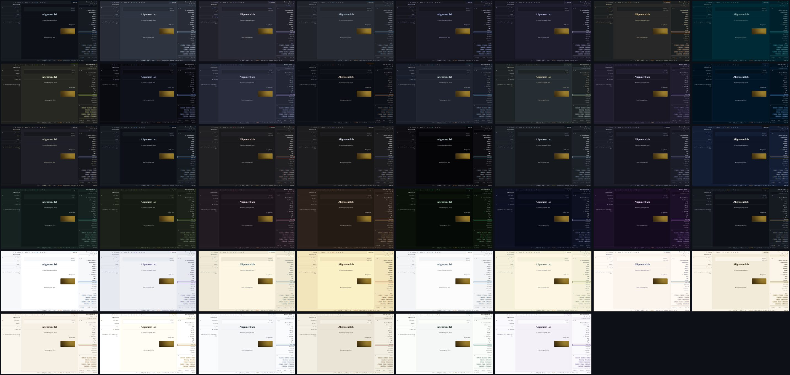

# Theming

*The forty-six built-in themes, the ambient masthead, the custom-theme builder, the CSS variables the app is painted with, and `custom.css`.*

← [Back to the README](../README.md) · [All docs](README.md)

---

If Astrolabe is replacing your blog, you probably want it to stop saying "Astrolabe" and start looking like *your* site. Three settings cover that, and none of them needs you to change the code.

## Name it

`SITE_NAME=Night Garden` changes the name everywhere it shows: the `✦` wordmark in the sidebar, the browser tab titles (`Note · Night Garden`) and the sign-in dialog.

## Pick the default look

A **theme** is a complete set of colours for the app: the page background, the text, the accent colour used for links and marks, the selection colour, the focus ring, the graph, the thirteen callout colours, the eight colours of syntax highlighting, and the roundness of the corners. Astrolabe ships **forty-six** themes, thirty-two dark and fourteen light. Every one of them defines the whole set for itself, so none of them is just another theme with a different background. Twenty-four are palettes that code editors and terminals already agree on, under the names people know them by and taken from their published specifications; in those, the sidebar, the tab strip and the panels stand on the darker ground their editors use, so a Dracula theme reads as Dracula from the first glance. **GitHub Dark is the default.**

We call each theme a *room*, because that is what it feels like to sit in one for an afternoon.



| Dark | | Light | |
| --- | --- | --- | --- |
| `github-dark` | solid neutral greys, sky blue — **the default** | `github-light` | clean white, link blue |
| `nord` | arctic blue-greys, frost cyan | `catppuccin-latte` | soft light grey, mauve |
| `dracula` | purple-grey night, violet and pink | `solarized-light` | cream paper, blue |
| `one-dark` | Atom's grey, soft blue | `gruvbox-light` | warm cream, burnt orange |
| `tokyo-night` | deep blue night, neon blue and violet | `ayu-light` | bright white, blue |
| `catppuccin-mocha` | soft dark lavender, pastel mauve | `everforest-light` | warm paper, forest green |
| `gruvbox-dark` | warm retro dark, orange | `rose-pine-dawn` | dawn cream, pine |
| `solarized-dark` | deep teal-black, cyan | | |
| `monokai` | olive-black, lime green | | |
| `material-ocean` | near-black navy, ocean blue | | |
| `palenight` | muted indigo night, lilac | | |
| `ayu-dark` | true dark, warm orange | | |
| `ayu-mirage` | slate blue-grey, sky blue | | |
| `everforest-dark` | forest green-grey, sage | | |
| `rose-pine` | velvet purple-black, iris | | |
| `night-owl` | midnight navy, sky blue | | |
| `kanagawa` | ink-wash charcoal, wave blue | | |
| `iron-gall` | warm near-black, gold leaf | `parchment` | warm paper, gold leaf |
| `cinnabar` | neutral graphite, vermilion type | `sandstone` | dry desert paper, burnt orange |
| `sumi` | ink-stick grey, aizome indigo | `solar` | brightest white paper, burnt gold |
| `void` | true black, cold signal cyan | `linen` | cool daylight, ink blue |
| `basalt` | cool blue-grey stone, pale sky | `palimpsest` | scraped grey astrolabe, rubric red |
| `nocturne` | blue-black night, periwinkle | `porcelain` | glazed white, deep celadon |
| `lapis` | deep lapis blue-black, brightened gold | `mauveine` | pale lilac, aniline violet |
| `verdigris` | green-black, oxidized copper | | |
| `moss` | olive-black forest floor, lichen | | |
| `porphyry` | purple-black stone, dusty rose | | |
| `tallow` | warm brown paper, candle-flame amber | | |
| `phosphor` | CRT green-black, P1 phosphor green | | |
| `sidereal` | blue-violet deep space, starlight | | |
| `murex` | violet-black, Tyrian purple | | |
| `graphite` | solid neutral greys (GitHub dark), gold leaf; the brand's room | | |

Six of them arrived together, and each was drawn to fill a gap the set had:

- **`phosphor`** is a real terminal, not a theme that hints at one. Its code colours are its identity. An old cathode-ray tube has one electron gun, so keywords, functions and properties are three strengths of the same green, type names are that green pushed towards cyan, and the only colours that are not green are the amber of a P3 tube (strings and numbers) and the red of an alarm.
- **`sidereal`** is deep space seen from far away: a blue-violet ground much darker than `nocturne`'s, under starlight. Its body text is a *neutral* silver on purpose. Starlight and body text are both pale blue-whites, and an accent that is just a shade of the text is not an accent (that is the 18 ΔE rule explained below). The two sit 29.6 ΔE apart.
- **`murex`** is named after the sea snail that the city of Tyre boiled by the ton to make the one colour an emperor was allowed to wear. `porphyry` is the *other* imperial purple; the two are kept 39.6 ΔE apart in their accents: a warm dusty rose there, the dye at full strength here.
- **`palimpsest`** is older than `parchment`, and that is the point: a sheet scraped clean and written over, grey where parchment is golden, under the red the rubricator used for headings. It is also the light set's first red room.
- **`porcelain`** is Song-dynasty celadon: a glaze-white ground with a breath of green in it, under the deep sea-green the Longquan kilns were built for. The refined room, and the light set's first green accent.
- **`mauveine`** is the accident that started the dye industry: in 1856 William Perkin, aged eighteen, failed to make quinine and rinsed the flask out with alcohol; the purple residue became the first synthetic dye. The light set had no violet until this one.

Every reader picks their own theme in the **theme picker**. The theme control in the status bar opens it, and so does **Settings → This device → Your theme**. Each row is a miniature of the room (its ground carrying a heading rule, a line of type and an accent chip) next to a human name and a one-line description, both translated. The raw id, which is what `DEFAULT_THEME` and the palette accept, is in the row's tooltip. The list is grouped and driven by the keyboard: `↑↓←→` move the highlight and apply that theme live to the whole app behind the panel, `Enter` keeps it, and `Esc` puts back the theme you started with. The mouse never moves the keyboard highlight; only a click picks. The command palette has exactly one route to the themes: *Themes* opens the same panel, with a dot marking the theme you are in. (It used to list a `Theme: <id>` command for every theme, which was 15 of 41 palette entries spent on one preference, each a blind jump into a room you had not seen. A setting with this many values belongs behind a surface that shows the values.) A reader's choice is remembered in their own browser.

**By default, the public site wears the theme you write in.** You pick a room in the picker, and first-time visitors land in the same room: a one-author blog that looks like its author, with nothing to configure. Your theme lives in your browser, so Astrolabe copies it to the server once your choice settles (a second after you stop browsing themes, not once per row). Both places that choose a theme say so plainly, naming the theme: the picker's footer and **Settings → Publishing & comments → Default theme** read *"Visitors see Cinnabar — following your editor theme"*, each with a one-click **Pin this instead**. Pin a theme and the public site stops moving with you (*"Visitors see Parchment — pinned"*, with **Follow my theme** to undo it). `DEFAULT_THEME=cinnabar` pins the same way from the environment, and `DEFAULT_THEME=follow` (or the setting) puts it back. Your pin and your editor theme are stored separately, so unpinning puts visitors back on whatever you are actually using. A reader who has chosen a theme of their own is never moved by any of this. An unknown `DEFAULT_THEME` is ignored, with a line on stderr at startup rather than silently.

## Easy on the eyes

A light room is bright by design, and a bright screen late in the day is a different problem from a wrong theme. So beside the theme there are two sliders in **Settings → This device** that sit *over* whatever theme you are in instead of replacing it:

- **Screen warmth** lays an amber tint over the whole page, the way a phone's night light does. The interface, the note, the dialogs and the PDF reader all take the colour of paper under a reading lamp, and the blue that tires eyes goes with it. Drag until the page stops glaring: 40 to 60 is a lamp, 100 is candlelight.
- **Dim the screen** darkens the page below the point your monitor's own brightness control can reach, for the screen whose lowest setting is still too bright at midnight. It stops at 70; past that the text would fade along with the glare.

Both apply as you drag. Both are **per device**: they never sync to your other machines (a phone has its own night light), they are never saved into the vault, and a visitor never sees them. The command palette carries **Warm the screen** and **Cool the screen** for the one-key version: it flips the warmth between off and the level you last used. Neither tint is printed.

If what you want is a warm *room* rather than a warm tint, the light half of the picker already has four: `parchment`, `sandstone`, `palimpsest` and `linen` are paper-toned by design, and the warmth slider stacks on any of them.

## The ambient masthead

A theme is a set of colours that do not move, and that is deliberate: every check in this repository measures those colours against one another, and a colour that changes over time is a colour nobody screenshotted at the moment it failed a contrast test. So the rooms stay still, and motion is a separate, optional layer of **decoration behind the words**.

Turn it on in **Settings → Publishing & comments → Ambient masthead** (or `"ambient": true` in `settings.json`; it is **off** by default). The public site's masthead, in the stock blog and the designed layout alike, then carries a slow atmosphere drawn from the theme in force:

| Air | Rooms | What it is |
| --- | --- | --- |
| stars | `sidereal`, `nocturne`, `lapis`, `murex` | two star fields at different scales and speeds, the far one breathing |
| scanlines | `phosphor`, `void` | a 3px grating creeping exactly one pitch every twelve seconds, under the gun's own glow |
| dust | `iron-gall`, `tallow`, `parchment`, `palimpsest`, `solar` | gold motes rising, slowly enough that looking straight at them shows a still page |

Every other room stays still on purpose: a theme gets an air only when it has something to say with one. Every mark in every air is drawn in that room's **own `--accent`** colour, so `murex`'s stars are Tyrian purple and `palimpsest`'s dust is rubric red without any rule of their own.

Four properties hold, whatever else changes:

- **It is decoration, not content.** An empty `aria-hidden` element with `pointer-events: none`, at `z-index: -1`, inside a masthead that carries `isolation: isolate`. No pointer, caret, screen reader or Tab key can reach it.
- **It is pure CSS.** No canvas, no `requestAnimationFrame`, no JavaScript beyond the one `if` that decides whether the element is on the page. Both animated properties are ones the browser can animate on the graphics card.
- **It is a whisper, and that is a measurement.** Not an opacity setting but the worst *actual* ground under the masthead title, read off real pixels with the animation running: `phosphor` 11.41:1, `murex` 10.74:1, `sidereal` 9.63:1, `iron-gall` 9.08:1, `parchment` 8.31:1. The floor is 4.5.
- **`prefers-reduced-motion` deletes it.** Not paused, not slowed: `display: none` on the container, so neither layer gets a box and nothing is drawn. Two screenshots 2.6 seconds apart come back byte-identical.

The code rides in the public layouts' own files (`client/styles/ambient.css`), so an instance with it switched off, and the main bundle every visitor downloads, pay nothing for it.

## Make your own

The built-in themes are a starting point, not a ceiling. **Themes → New custom theme** opens a builder. Pick one of the built-ins as a base, then override any colour you like: the grounds, the text, the **headings**, the accent, the borders, and every surface on its own (the sidebar, the tab strip, the status bar, the editor page, the reading page, the fields and buttons, the dialogs, the site, the cards; find any of them by name in the filter), plus the thirteen callout colours, the eight syntax colours and the graph. The whole app changes behind the panel as you work, because the only honest preview of a theme is the theme itself. Colours you do not touch keep coming from the base theme, so a later improvement to that base reaches your theme for free, and every row's *reset* deletes your override rather than freezing today's value into it.

The builder runs **the project's own contrast check, live**: the same code `scripts/check-contrast.mjs` runs. Body text must be at least 4.5:1 against all three grounds and secondary text at least 3:1; the accent must be at least 4.5:1 on its own ground; and the accent must be at least 18 ΔE away from your body text. (ΔE measures how different two colours look to a person. This last rule is not a contrast ratio: a theme whose accent is just a shade of its own text has no accent at all.) Warnings appear in words, above the control that caused them, with a mark on any group that holds one.

Save the theme under a name and it can be chosen **everywhere a built-in theme can**: the picker (in its own "Your themes" group), the ☾/☀ button, **Settings → Publishing & comments → Default theme**, and `DEFAULT_THEME=custom:<name>` in your `.env`. Export it as JSON, mail it, import it on another instance.

## Restyle it

Put a file called `custom.css` in your data directory (`ASTROLABE_DATA`, default `./data/`). Astrolabe serves it at `/api/custom.css` and loads it after its own stylesheets, for every visitor and for you, in dev and in production, with no rebuild and no restart. Because it loads last, your rules win. The whole interface is painted with CSS custom properties (variables) on `:root`, with per-theme overrides under `html[data-theme="…"]`, so most re-skins are a handful of lines:

```css
/* data/custom.css — a green-accented reading room */
:root,
html[data-theme="lapis"] {
  --accent: #5da06b;
  --accent-soft: rgba(93, 160, 107, 0.14);
  --font-serif: "Iowan Old Style", Georgia, serif;
}
```

**The site's name and tagline have one CSS class each, wherever they appear.** `.s-site-name` is on the masthead's name above every article and on the home page's hero alike, and `.s-site-tagline` is on both taglines, so a rule written once reaches both:

```css
/* data/custom.css — a Kufic wordmark everywhere the site names itself */
.s-site-name { font-family: "Reem Kufi", var(--font-serif); font-weight: 600; }
.s-site-tagline { letter-spacing: 0.35em; text-transform: lowercase; }
```

The variables (set them on `:root` for all themes, or under `html[data-theme="void"]` and so on for one):

| Token | Drives |
| ----- | ------ |
| `--bg` / `--bg-raised` / `--bg-hover` | Page background / sidebar & panels / hover rows |
| `--text` / `--text-muted` / `--text-faint` | Body text / secondary text / hints & counts |
| `--heading` | Every heading — the editor's, the reading view's, the article title on the blog and the library's page titles. Each built-in sets it a shade toward its accent; a custom theme sets it outright |
| `--accent` / `--accent-soft` | Brand color (links, wikilinks, active marks) / its translucent wash |
| `--selection-bg` / `--focus-ring` | Text-selection wash / the 2px `:focus-visible` ring |
| `--graph-node` / `--graph-edge` / `--graph-vignette` | Graph disc color / idle edge stroke / the canvas's edge wash |
| `--border` | The 1px hairlines everywhere |
| `--danger` | Destructive actions, broken-link tint |
| `--font-ui` / `--font-serif` / `--font-mono` | UI chrome / prose & headings / code |
| `--font-base` | Root type size — the entire UI is sized in `rem`, so this one token scales all chrome (default 15.5px) |
| `--font-prose` | Editor / reading prose size (default ≈18px; the blog article body sits a step above it) |
| `--radius` | Corner rounding (default 6px) |
| `--sidebar-w` | Sidebar width (default 292px) |
| `--callout-note`, `--callout-tip`, … | Per-type callout hues (see `client/styles/tokens.css`) |
| `--syn-keyword`, `--syn-string`, … | Code-highlighting palette |

**The surface layer.** Everything above is a *base* variable. The interface used to read those directly, so a theme could not recolour its sidebar without recolouring every raised surface at once. Now every painted thing has a variable of its own, defined on `:root, [data-theme]` as a derivation of a base variable (`--sidebar-bg: var(--bg-raised)`). That means two things at once: a base variable you change still flows into every surface you have not touched, and a surface you set moves alone. The builder lists all of them under human names, in both languages, with a filter over the rows and a reset per group; `custom.css` can set any of them by name. Text on a ground is measured like the base pairs: `--sidebar-text` on `--sidebar-bg` at 4.5:1, secondary text at 3:1, and the builder says so in words when a pair fails. The six highlighter inks are deliberately not here: a highlight that changed colour with the theme would be data loss, not a theme.

| Surface | Tokens (each follows the base in brackets until you set it) |
| --- | --- |
| Sidebar | `--sidebar-bg` (var(--bg-raised)), `--sidebar-text` (var(--text)), `--sidebar-muted` (var(--text-muted)), `--sidebar-border` (var(--border)), `--sidebar-hover-bg` (var(--bg-hover)), `--sidebar-active-bg` (var(--accent-soft)), `--sidebar-active-bar` (var(--accent)), `--sidebar-search-bg` (var(--bg)), `--tagpill-bg` (var(--bg-hover)), `--tagpill-text` (var(--text-muted)) |
| Tabs & panels | `--tabs-bg` (var(--bg-raised)), `--tabs-border` (var(--border)), `--tab-text` (var(--text-muted)), `--tab-hover-bg` (var(--bg-hover)), `--tab-active-bg` (var(--bg)), `--tab-active-text` (var(--text)), `--tab-active-bar` (var(--accent)), `--panel-bg` (var(--bg-raised)), `--panel-text` (var(--text)), `--panel-heading` (var(--text-faint)), `--panel-border` (var(--border)) |
| Status bar | `--statusbar-bg` (var(--bg-raised)), `--statusbar-text` (var(--text-muted)), `--statusbar-border` (var(--border)) |
| Editor & code | `--editor-bg` (var(--bg)), `--editor-text` (var(--text)), `--editor-caret` (var(--accent)), `--editor-panel-bg` (var(--bg-raised)), `--codeblock-bg` (var(--bg-raised)), `--codeblock-text` (var(--text)), `--inline-code-bg` (var(--bg-raised)), `--inline-code-text` (var(--text)), `--code-border` (var(--border)) |
| Reading | `--reading-bg` (var(--bg)), `--reading-text` (var(--text)), `--quote-bar` (var(--accent)), `--quote-text` (var(--text-muted)), `--highlight-bg`, `--hr` (var(--accent)), `--list-bullet` (var(--accent)), `--table-border` (var(--border)), `--table-head-bg` (var(--bg-raised)), `--table-head-text` (var(--text-muted)), `--props-bg` (var(--bg-raised)), `--footnote-marker` (var(--accent)) |
| Links & tags | `--link` (var(--accent)), `--wikilink` (var(--accent)), `--wikilink-broken`, `--tag-bg` (var(--accent-soft)), `--tag-text` (var(--accent)) |
| Controls | `--button-text` (var(--text)), `--button-hover-bg` (var(--bg-hover)), `--button-accent-bg` (var(--accent-soft)), `--button-accent-text` (var(--accent)), `--input-bg` (var(--bg)), `--input-text` (var(--text)), `--input-border` (var(--border)), `--input-placeholder` (var(--text-faint)), `--input-focus` (var(--accent)), `--menu-bg` (var(--bg-raised)), `--menu-text` (var(--text)), `--menu-hover-bg` (var(--accent-soft)) |
| Dialogs & toasts | `--modal-bg` (var(--bg-raised)), `--modal-text` (var(--text)), `--modal-border` (var(--border)), `--backdrop`, `--toast-bg` (var(--bg-raised)), `--toast-text` (var(--text)), `--toast-bar` (var(--accent)), `--scrollbar-thumb` (var(--border)), `--scrollbar-thumb-hover` (var(--text-faint)) |
| Graph | `--graph-bg` (var(--bg)) |
| Site | `--blog-bg` (var(--bg)), `--blog-text` (var(--text)), `--blog-mast-text` (var(--text)), `--blog-mast-tagline` (var(--text-muted)), `--blog-mast-star` (var(--accent)), `--blog-nav-text` (var(--text-muted)), `--blog-nav-hover-bg` (var(--bg-hover)), `--blog-nav-active-bg` (var(--accent-soft)), `--blog-nav-active-text` (var(--accent)) |
| Cards & bars | `--card-bg` (var(--bg-raised)), `--card-text` (var(--text)), `--card-border` (var(--border)), `--card-hover-border` (var(--accent)), `--progress-track` (var(--bg-hover)), `--progress-fill` (var(--accent)) |

## Bring your own fonts (the CSS route)

Astrolabe ships no web fonts of its own, by design, but your instance can have some. Put font files into `ASTROLABE_DATA/fonts/` (default `./data/fonts/`) and they are served at `/api/fonts/<file>`: `woff2`, `woff`, `ttf` and `otf` only, by file name only, with ETags and a one-year immutable cache header. Then name them in an `@font-face` rule in `custom.css`:

```css
/* data/custom.css — serve data/fonts/MyFont.woff2 as the prose face */
@font-face {
  font-family: "MyFont";
  src: url("/api/fonts/MyFont.woff2") format("woff2");
  font-display: swap;
}
:root {
  --font-serif: "MyFont", Georgia, serif;
}
```

If you would rather not write CSS, there is a curated catalog of fonts served from your own server and an uploader, both with proper Arabic support: see [Typography](typography.md).

Anything beyond the variables is fair game too. Every element carries a stable class starting with `s-` (`.s-sidebar`, `.s-rv-p`, `.s-statusbar`, …), so `custom.css` can restyle specific parts of the interface. Keep body text at 4.5:1 contrast or better against `--bg` and the whole app stays readable.

## Colored text in two tiers

You can colour a span of text in a note in two ways. The default writes `var(--vc-blue)`: a *meaning* ("blue") that every built-in theme turns into a real colour that passes the AA contrast test on its own ground, light or dark. A second, fixed-ink palette writes a literal hex value when you mean *that exact* colour. Both render identically in the editor, the reading view and the blog, and the sanitizer allows `style` on a `<span>` only for `color` and `background-color`: no `url()`, no other properties.

The two tiers exist for a reason you can calculate. Against `void`'s `#050508` a colour needs a relative luminance of at least 0.186, and against `solar`'s `#ffffff` it needs at most 0.183, so **no single colour can pass AA on every theme**. The theme-aware tier (`var(--vc-*)`, the default) carries one value per theme *group* and is held to 4.5:1 against every ground in its group; its worst measurement is 4.98:1, on `palimpsest`'s ground, which took that title from `solar`'s white the day it shipped. The fixed-ink tier carries one hex value for all themes and is held to 3:1, the floor WCAG 1.4.11 sets for non-text elements, which is the most a fixed colour can promise. `node scripts/check-contrast.mjs` checks both; see [Development](development.md).
